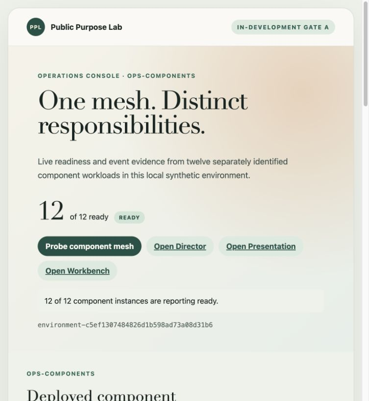
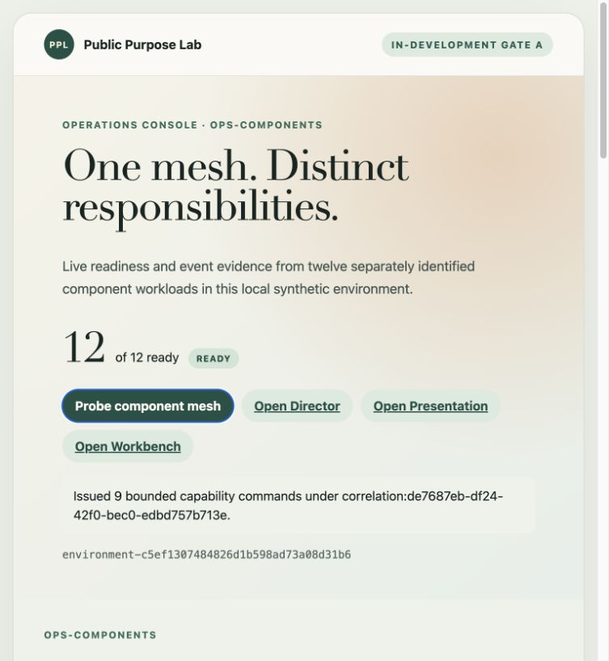

# Gate A: deployed component mesh

**Progress report, system-test record and show-and-tell**

| Evidence field        | Recorded value                                                            |
| --------------------- | ------------------------------------------------------------------------- |
| Status                | Implemented; founder acceptance and publication pending                   |
| Walkthrough           | 1 September 2026, local synthetic Minikube environment                    |
| Source revision       | `82d5ff3f27f61a04ad045899c838f20e2d9e258e`                                |
| Image digest          | `sha256:b71786a0ad7fb59186ef9c58d53915a1cb5178de69b277fb9f445d1dd4b66639` |
| Environment           | `environment-c5ef1307484826d1b598ad73a08d31b6`                            |
| Cluster profile       | `public-purpose-lab-gate-a`                                               |
| Trust profile         | Environment-local synthetic root; synthetic data only                     |
| Canonical requirement | `docs/scenarios/demonstration-scenarios-and-functional-requirements.md`   |

> Gate A is implemented and ready for founder review. This report does not close the gate, make a production claim or establish legal, regulatory, clinical or compliance assurance.

## Outcome at a glance

Gate A turns the approved component list into a real deployed mesh. Twelve separately identified workloads now run in Kubernetes, authenticate to the event infrastructure, report readiness and appear in a new Operations Console. The nine configurable component skeletons accept a bounded, non-business capability probe and return conclusive outcomes under one correlation identifier.

The walkthrough also re-opened the inherited Director, Presentation and Workbench surfaces and repeated the mesh test after restarting NATS and all nine configurable workloads. No source intake, knowledge ingestion, review decision or report generation has been simulated. Those user-visible capabilities remain in later gates.

## Approved objective and acceptance position

The approved Gate A objective was to deploy all required skeleton instances, authenticate them, publish honest readiness and make them visible in operations views. The accepted architecture allowed one configurable Rust component-host binary while preserving separate workload identities, permissions, readiness and failure boundaries.

| Acceptance requirement                                    | Evidence                                                                                | Position            |
| --------------------------------------------------------- | --------------------------------------------------------------------------------------- | ------------------- |
| Twelve expected components report ready                   | Operations screen and `/api/v1/mesh` showed 12 of 12                                    | Achieved            |
| Twelve distinct workload identities                       | Automated smoke checked uniqueness; the screen exposes each public NKey identity        | Achieved            |
| Operations refreshes from real events                     | Missing/stale/ready is derived from observed heartbeats, not seeded ready state         | Achieved            |
| Nine bounded commands have conclusive correlated outcomes | One probe issued nine commands; nine `component.command-accepted` outcomes were visible | Achieved            |
| Broker and component restart recover safely               | NATS and all nine component hosts were restarted; post-restart smoke passed             | Achieved            |
| Existing surfaces remain usable                           | Director, Presentation and Workbench were opened from the same image                    | Achieved            |
| Screenshot-backed report and verified PDF                 | This canonical report, its six screenshots and its rendered PDF                         | Achieved for review |
| Founder accepts the implemented flow                      | Explicit review decision has not yet been recorded                                      | Pending             |

## What existed before Gate A

M1-M3.4 already provided the architecture catalogue, versioned contracts, authenticated NATS carriage, environment-scoped synthetic identity, a scenario Director, presentation gateway, common Workbench surface, local Minikube deployment and a managed Google Cloud preview lifecycle. Those foundations proved identity and presentation-control invariants, but they did not deploy the complete source-to-report component set or provide a component-wide operational view.

Gate A retains those foundations and adds only the minimum mesh needed for visible, testable progress. The existing `scenario-director`, `presentation-gateway` and `identity-broker` continue to own CTL-01, CTL-02 and IAM-01. Nine new deployments use a shared configurable host image for their currently bounded responsibilities.

## Demonstrated flow

| Step | Actor and screen                                     | Command or event path                                           | Owning behaviour                                                                    | Visible result                                              |
| ---- | ---------------------------------------------------- | --------------------------------------------------------------- | ----------------------------------------------------------------------------------- | ----------------------------------------------------------- |
| 1    | Operator starts the dedicated Minikube profile       | Kubernetes starts NATS and 12 workloads                         | Each workload has its own configuration, identity and health boundary               | 12 of 12 pods become ready                                  |
| 2    | Presenter opens `OPS-COMPONENTS`                     | Readiness heartbeats arrive on `ppl.gate-a.events.<component>`  | OPS-01 projects only actually observed readiness                                    | 12 cards show ready with distinct instance and workload IDs |
| 3    | Presenter selects **Probe component mesh**           | OPS-01 publishes nine `O-001` v0.1 capability commands          | Each target validates version, issuer, environment, purpose, target and idempotency | One correlation ID is shown                                 |
| 4    | Components conclude the probe                        | Each target publishes accepted, duplicate or refused outcome    | The probe changes no business state                                                 | Nine accepted outcomes appear together in `OPS-EVENTS`      |
| 5    | Presenter opens Director, Presentation and Workbench | Existing HTTP surfaces are served by the exact same image       | Existing M3 responsibilities remain separate from Gate A probes                     | All three inherited surfaces remain reachable               |
| 6    | Operator restarts NATS and all component hosts       | Heartbeats cease and then resume; in-memory projection rebuilds | Readiness is recovered from new observations                                        | 12 ready and nine outcomes pass again after restart         |

```text
Director (CTL-01) -----------+
Presentation (CTL-02) -------+--> authenticated readiness events --+
Identity (IAM-01) -----------+                                      |
                                                                    v
AUT / DOM / CNT / KNO / WRK / RPT / AUD / OPS / INT instances --> NATS
       ^                                                            |
       +---------- bounded capability commands from OPS-01 <--------+
                                                                    |
Operations Console <------ real readiness and outcome projection <--+
```

<!-- pagebreak -->

## Walkthrough evidence

### 1. Complete mesh readiness

The Operations Console reports 12 of 12 ready for the exact environment. The status is calculated from component-owned readiness events. An expected catalogue may identify a missing component, but it cannot manufacture a ready result.



<!-- pagebreak -->

### 2. One bounded correlated probe

The presenter issues one visible probe. The UI records that nine bounded capability commands were sent under correlation `correlation:de7687eb-df24-42f0-bec0-edbd757b713e`.



<!-- pagebreak -->

### 3. Conclusive component outcomes

OPS-EVENTS shows the nine accepted outcomes for AUT-01, DOM-01, CNT-01, KNO-01, WRK-01, RPT-01, AUD-01, OPS-01 and INT-01. Readiness heartbeats are hidden by default so the conclusive outcomes remain legible.


<!-- pagebreak -->

### 4. Inherited Director surface

The Director remains the scenario-control surface. Gate A does not add scenario catalogue, environment or run controls; the current screen continues to label itself as an in-development walking skeleton.


<!-- pagebreak -->

### 5. Inherited Presentation surface

The Presentation surface remains independently addressable and target-owned. Gate A does not claim that a component probe is a presentation or business outcome.


### 6. Inherited Workbench surface

The Workbench remains a governed surface skeleton. Upload, paste, source status, knowledge query, review and report functions are intentionally not introduced in Gate A.


<!-- pagebreak -->

## Components and responsibilities exercised

| Component | Deployed instance        | Gate A behaviour exercised                                                | Business behaviour deliberately absent    |
| --------- | ------------------------ | ------------------------------------------------------------------------- | ----------------------------------------- |
| CTL-01    | `scenario-director-1`    | Authenticated readiness; inherited M3 flow remains available              | New scenario catalogue or orchestration   |
| CTL-02    | `presentation-gateway-1` | Authenticated readiness; inherited presentation surface remains available | New semantic Gate B views                 |
| IAM-01    | `identity-broker-1`      | Authenticated readiness; inherited synthetic identity flow passes         | New Workbench actor placement UI          |
| AUT-01    | `authorisation-1`        | Bounded capability command and conclusive outcome                         | Protected business-action decision        |
| DOM-01    | `engagement-1`           | Bounded capability command and conclusive outcome                         | Engagement creation                       |
| CNT-01    | `source-governance-1`    | Bounded capability command and conclusive outcome                         | Upload, quarantine, validation or staging |
| KNO-01    | `knowledge-processing-1` | Bounded capability command and conclusive outcome                         | Ingestion, RAG or cited query             |
| WRK-01    | `review-workflow-1`      | Bounded capability command and conclusive outcome                         | Review task or human decision             |
| RPT-01    | `reporting-1`            | Bounded capability command and conclusive outcome                         | Report preview or release                 |
| AUD-01    | `audit-evidence-1`       | Bounded capability command and conclusive outcome                         | Durable scenario reconstruction           |
| OPS-01    | `operations-1`           | Real readiness projection, probe issue and event timeline                 | Durable logs or evidence store            |
| INT-01    | `event-infrastructure-1` | Authenticated event carriage and capability outcome                       | Business ownership or exactly-once claim  |

## Screens and functions added or changed

| Surface                 | Added or changed          | Function and rule                                                                                                              |
| ----------------------- | ------------------------- | ------------------------------------------------------------------------------------------------------------------------------ |
| `OPS-COMPONENTS`        | New Operations Console    | Shows expected instances against observed readiness, source revision, image digest, public workload identity and last activity |
| `OPS-EVENTS`            | New event timeline        | Shows privacy-minimised event type, component and time; readiness heartbeats are optional                                      |
| Component probe control | New bounded action        | Issues one no-business-effect command to each of the nine configurable instances under one correlation ID                      |
| Director                | Existing surface retained | Link from Operations; no new Gate A scenario claim                                                                             |
| Presentation            | Existing surface retained | Link from Operations; presentation state remains distinct from business completion                                             |
| Workbench               | Existing surface retained | Link from Operations; later business functions remain clearly future work                                                      |

<!-- pagebreak -->

## Contracts and rules exercised

The Gate A `O-001` v0.1.0 event shape is a working implementation binding, not an approved canonical logical contract. Every command carries contract and version, issuer, target, environment, purpose, correlation, causation, idempotency and time. Every receiver validates those fields before accepting the probe.

- Each workload uses an environment-generated NKey and least-privilege NATS publish/subscribe permissions.
- Component ID, instance ID and workload identity are distinct and visible.
- `ready` is derived from an observed heartbeat no more than 15 seconds old; unobserved is `missing`, expired is `stale`.
- Exact command redelivery returns a duplicate outcome; changed content under the same idempotency key is refused.
- Capability probes have no business side effect and cannot create engagement, source, knowledge, review or report state.
- Operations events exclude credentials, private keys and source bodies.
- The environment-local synthetic root remains inside the environment setup directory and is not mounted as an application private key.
- The managed-hosted overlay does not enable local-synthetic Gate A readiness by default.

Every configurable host exposes liveness, readiness, understood-contract and component-summary endpoints. OPS-01 additionally exposes mesh, event and probe endpoints. These endpoints support Gate A observability; they are not a general management API.

## System-test evidence

| Check                    | Exact evidenced result                                                                                                                                                                                           |
| ------------------------ | ---------------------------------------------------------------------------------------------------------------------------------------------------------------------------------------------------------------- |
| Repository quality suite | Architecture 21 components/40 contract families; 20 schemas/40 fixtures/20 compatibility descriptors; formatting, links, frontend types/tests, Rust formatting/clippy/tests, M1 and M2 runtime checks all passed |
| Rust tests               | 60 tests passed, including two new component-host tests                                                                                                                                                          |
| Gate A cold smoke        | 12 distinct workloads ready; nine conclusive outcomes under one correlation                                                                                                                                      |
| Inherited M3 smoke       | External/synthetic session path, CSRF refusal, semantic cue, checkpoint, reset and successor isolation passed                                                                                                    |
| Restart smoke            | NATS plus all nine configurable workloads restarted; 12 ready and nine outcomes passed again                                                                                                                     |
| Kubernetes manifests     | Gate A Helm lint/template and both M3 Kustomize variants rendered successfully                                                                                                                                   |
| Shell and YAML checks    | Changed shell scripts passed ShellCheck; Compose parsed as 14 services; `git diff --check` passed                                                                                                                |

The final post-restart walkthrough used correlation `correlation:de7687eb-df24-42f0-bec0-edbd757b713e`. The Operations API returned exactly nine accepted outcomes, one from each configurable component.

<!-- pagebreak -->

## Adverse evidence and operational lesson

During the exact-revision redeployment, the dedicated cluster was briefly supplied with a newly generated environment identity while its retained IAM volumes still belonged to the original Gate A environment. IAM-01 stopped safely with `IAM state is inconsistent`; it did not silently adopt the new trust domain. The old state and both environment directories were preserved. Reapplying the original `.local/gate-a-minikube` environment restored the consistent trust and state binding.

This is positive fail-closed security evidence, but it also exposes an operator-experience gap. A later change should bind profile, environment ID and retained state explicitly and refuse the rollout before workloads are replaced when they do not match. No retained state should be deleted or repaired implicitly.

## Limitations and deferred work

- The nine component instances are genuine deployments and event participants, but their only Gate A handler is a non-business capability probe.
- The Operations projection is in memory and reconstructs readiness from recurring events. It is not durable audit evidence.
- Probe idempotency is process-local because the probe has no side effect. State-changing commands will require durable ownership and reconciliation.
- `O-001` v0.1.0 is a working binding and may change when later flows supply better evidence.
- Missing and stale states are implemented, but the founder walkthrough concentrated on ready, outcome and restart recovery rather than a screenshot of every adverse display state.
- Gate A was exercised in a dedicated local Minikube profile. Compose is represented in CI but was not run through a local Docker daemon, and the Gate A extension was not deployed to Google Cloud.
- The branch and evidence are local. Hosted CI, pull-request review and publication remain pending founder approval.
- No real or confidential data was used. The evidence does not establish production fitness, privacy compliance or accountable business authority.

## What Gate A establishes

Gate A establishes a concrete, observable platform shape on which real scenarios can now be built: all named components exist as separately authenticated workloads; they can exchange bounded events; the Operations Console reports what was actually observed; and the inherited presentation-control skeleton remains available.

It does not establish the value path the founders ultimately want. There is still no real scenario catalogue, no visible placement of a synthetic reviewer into Workbench, no source upload, no processing, no cited query, no human review and no report. Gate A should therefore be accepted as a mesh gate, not as business-value completion.

<!-- topspace -->

## Next gate: DS-01 and DS-02

Gate B should make the platform demonstrably useful to a presenter before source processing begins. Its user-visible outcome is a Director-led environment and scenario introduction that places a synthetic reviewer into Workbench and moves the Presentation and Workbench surfaces through semantic views without URL or DOM control.

The founder-review package for Gate B should exercise:

1. `DIR-ENVIRONMENT` with environment, trust profile and honest component readiness;
2. Director external sign-in and `DIR-CATALOGUE` admission reasons;
3. creation of one Demonstration Session without prematurely creating a synthetic application session;
4. backend-only placement and termination of `synthetic-reviewer` in Workbench;
5. `PRES-INTRO`, `WB-ENGAGEMENT` and `WB-SOURCE-INTAKE` semantic view requests;
6. equivalent ordinary Workbench navigation and a visible pause state; and
7. explicit refusal of unsupported or expired view requests.

Gate B should select only the contract bindings required by that walkthrough. DS-03 source intake remains the following gate and the first functional business-processing path.
