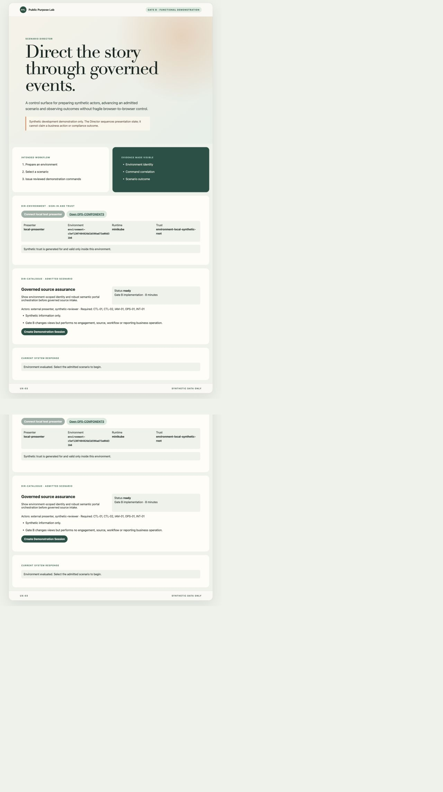

# Gate B: environment, identity and portal orchestration

**Draft progress report, system-test record and show-and-tell**

| Evidence field        | Recorded value                                                                       |
| --------------------- | ------------------------------------------------------------------------------------ |
| Status                | Exact-build review candidate; visual walkthrough, PDF and founder acceptance pending |
| Automated walkthrough | 1 September 2026, local synthetic Minikube environment                               |
| Source revision       | `675c36e417349eaad5dae8d07f062edf98eebd80`                                           |
| Local image           | `public-purpose-lab/m3-runtime:gate-b-review-exact`                                  |
| Runtime image ID      | `sha256:b32cd50d7103211e09af436bd309e9a0b1a949971df125ce64025bf0d3118087`            |
| Package               | `presentation-control-assurance` v1.2.1                                              |
| Package digest        | `15b78a9bfb7290eeb256e91ea61d24f404fe375e5adb2e0316023fe20b4547d4`                   |
| Environment           | `environment-c5ef1307484826d1b598ad73a08d31b6`                                       |
| Cluster profile       | `public-purpose-lab-gate-a`                                                          |
| Trust profile         | Environment-local synthetic root; synthetic data only                                |
| Canonical requirement | `docs/scenarios/demonstration-scenarios-and-functional-requirements.md`              |

> This is partial in-development evidence. It does not close Gate B and does not establish production, compliance, legal, regulatory or clinical assurance.

## Outcome at a glance

The implemented Gate B baseline turns the inherited presentation-control
skeleton into the approved DS-01/DS-02 journey. The Director now shows the
environment and admitted scenario, creates and controls the Demonstration
Session, assigns a backend-only synthetic reviewer to Workbench, and requests
target-owned semantic views. Presentation and Workbench return conclusive view
outcomes, while Operations receives the correlated control, identity and view
events.

Source-intake controls are visible but deliberately non-submitting. Gate C
will add the first business process and component-owned source state.

## Acceptance position

| Requirement                                | Current evidence                                                        | Position                                    |
| ------------------------------------------ | ----------------------------------------------------------------------- | ------------------------------------------- |
| Environment, trust and presenter visible   | Authenticated environment endpoint and implementation walkthrough       | Implemented; exact-build screenshot pending |
| Admitted scenario and limitations visible  | Authenticated catalogue and implementation walkthrough                  | Implemented; exact-build screenshot pending |
| Session created without synthetic reviewer | Automated walkthrough checks the separate creation and assignment steps | Achieved automatically                      |
| Synthetic reviewer visible in Workbench    | Context API checks actor, role, environment, trust and expiry           | Achieved automatically; screenshot pending  |
| `PRES-INTRO` target-owned outcome          | SSE cue and `P-004 applied` outcome                                     | Achieved automatically; screenshot pending  |
| `WB-ENGAGEMENT` and `WB-SOURCE-INTAKE`     | Separate Workbench cues and outcomes                                    | Achieved automatically; screenshots pending |
| Ordinary Workbench navigation              | Implemented browser controls with no business event                     | Browser walkthrough pending                 |
| Unsupported view refused                   | Director returned HTTP 409 and emitted `view.refused`                   | Achieved automatically                      |
| Pause, stop, reset and session termination | State and successor checks passed                                       | Achieved automatically                      |
| Exact-build show-and-tell PDF              | Requires the remaining browser screenshots and visual QA                | Pending; gate remains open                  |

## Demonstrated flow

| Step | Actor and screen                                      | Component/event path                                            | Expected visible result                                        |
| ---- | ----------------------------------------------------- | --------------------------------------------------------------- | -------------------------------------------------------------- |
| 1    | Presenter signs into `DIR-ENVIRONMENT`                | Director validates external application session                 | Presenter, environment, runtime and trust profile appear       |
| 2    | Presenter opens `DIR-CATALOGUE`                       | Director evaluates the admitted package against the environment | Governed source assurance is ready with honest limitations     |
| 3    | Presenter creates and prepares the session            | `D-002` lifecycle plus bounded logical time                     | Session and revision become visible; no synthetic reviewer yet |
| 4    | Surface operators register Presentation and Workbench | `P-002` role-specific registrations                             | Each target owns a current connection generation               |
| 5    | Presenter assigns `synthetic-reviewer`                | Director → NATS → IAM-01 → target Workbench backend             | Workbench shows actor, reviewer role, trust profile and expiry |
| 6    | Presenter starts and shows introduction               | `P-003 pres-intro` → Presentation → `P-004 applied`             | Audience sees scenario purpose, actors, outcome and limits     |
| 7    | Presenter opens engagement and intake                 | `P-003 wb-engagement`, then `wb-source-intake`                  | Workbench changes view without a route or DOM instruction      |
| 8    | User navigates within Workbench                       | Local accessible navigation only                                | Same views are usable without Director; no business event      |
| 9    | Presenter tests unsupported view and pauses           | Pre-delivery refusal; `D-002 pause`                             | Refusal is explicit and `DIR-RUN` reports paused               |
| 10   | Presenter stops and resets                            | Synthetic bindings terminated; successor created                | Presenter remains signed in; old Workbench actor is terminated |

## Screenshot evidence retained so far

The exact-build visual evidence set is incomplete, so no Gate B PDF has yet
been produced.

Figure 1 is useful design evidence but is not exact-build closure evidence. It
predates source revision `675c36e` and must therefore be replaced in the final
closure set.

The remaining closure set must capture the active `DIR-RUN`, `PRES-INTRO`,
Workbench reviewer banner, `WB-ENGAGEMENT`, `WB-SOURCE-INTAKE`, paused state and
the correlated Operations timeline from the exact review build.

## Automated system-test evidence

The exact-build CLI-driven walkthrough used Demonstration Session
`session:2f25fc11-57e9-448a-bd8d-5821e75fdb46` and checked:

- CSRF refusal with HTTP 401;
- distinct audience and Workbench surface sessions;
- audience actor `synthetic-audience-user` and Workbench actor
  `synthetic-reviewer` with role `workbench-reviewer`;
- environment ID, environment-local synthetic trust and bounded expiry;
- `pres-intro`, `wb-engagement` and `wb-source-intake` cue delivery and applied
  target outcomes;
- HTTP 409 for `wb-not-admitted`;
- pause/resume, stop, reset and termination of both synthetic sessions; and
- a clean successor session with no inherited checkpoint or logical-time state.

The Operations query for that exact-build session returned 20 events comprising
`scenario.started`, `scenario.step.requested`, `scenario.paused`,
`scenario.stopped`, `scenario.reset`, `surface.registered`,
`synthetic-session.established`, `synthetic-session.terminated`,
`view.requested`, `view.applied` and `view.refused` under the scenario
correlation scope.

The Gate A regression also passed on the same image: all 12 distinct workloads
reported ready and nine capability commands concluded under
`correlation:5c9b04a6-3d8f-460d-85c8-b297bd5fd874`. Kubernetes reported the
recorded runtime image ID for all 12 workloads. Director and Presentation
Gateway both reported source revision `675c36e`, the same image ID and their
admitted package or manifest version through `/health/contracts`.

## Functions, rules and components changed

The detailed implementation baseline is recorded in
`docs/architecture/gate-b-orchestration.md`. In summary, Gate B changes CTL-01,
CTL-02, IAM-01 integration, the Director, Presentation, Workbench and
Operations surfaces, the scenario package and the presentation examples. It
does not add behaviour to DOM-01, CNT-01, KNO-01, WRK-01, RPT-01 or AUD-01.

## Limitations and next steps

- The Operations projection remains transient rather than durable audit
  evidence.
- Surface links are environment configuration; orchestration remains semantic
  event based.
- No source content is sent, stored or processed and no engagement record is
  created.
- The Gate B browser walkthrough and screenshot set must be completed on the
  exact review revision before rendering and visually checking the PDF.
- Gate C then implements DS-03: upload/paste, quarantine, validation, staging,
  processing status, logs and events as the first functional business path.
