# Gate B: environment, identity and portal orchestration

**Progress report, system-test record and show-and-tell**

| Evidence field          | Recorded value                                                               |
| ----------------------- | ---------------------------------------------------------------------------- |
| Status                  | Founder accepted; Gate B formally closed for publication on 1 September 2026 |
| Walkthrough             | 1 September 2026, local synthetic Minikube environment                       |
| Review branch revision  | `dc521eeb2be517557a8083b7e336d304ce99262d`                                   |
| Runtime source revision | `8b5c0e4089fde20a3c6a28ced9bb6d8b32399276`                                   |
| Runtime image           | `public-purpose-lab/m3-runtime:gate-b-review-exact-2`                        |
| Runtime image ID        | `sha256:f00d90dbead3a9de58a1e63b12493b6c8a791e1a85767a2d413fe56838499434`    |
| Package                 | `presentation-control-assurance` v1.2.1                                      |
| Package digest          | `15b78a9bfb7290eeb256e91ea61d24f404fe375e5adb2e0316023fe20b4547d4`           |
| Environment             | `environment-c5ef1307484826d1b598ad73a08d31b6`                               |
| Cluster                 | `public-purpose-lab-gate-a`                                                  |
| Trust profile           | Environment-local synthetic root; synthetic data only                        |
| Evidence session        | `session:e753a0a7-a0d3-437d-b776-4c5f29e1662f`                               |
| Screen-detail pass      | `session:03247293-4eab-4244-9b5d-7077bf763de3`                               |
| Final clean successor   | `session:905e83a1-a1a8-49d2-a03b-dbdbe2efb0af`                               |

> This is in-development demonstrator evidence. It does not establish production, legal, regulatory, clinical or compliance assurance, and it does not transfer accountable human authority to the Lab.

## Outcome

Gate B now delivers a visible, end-to-end demonstration framework rather than
only abstract contracts. A presenter can inspect the environment and admitted
scenario, create and control a Demonstration Session, establish a signed
environment-bound synthetic reviewer, and direct semantic views on independent
Presentation and Workbench surfaces. Operations shows the correlated requests,
outcomes and refusals.

The Workbench visibly offers the next business path, including upload, link,
paste and provenance controls. Those controls are deliberately non-submitting
in Gate B. Gate C will make governed source intake the first real business
process.

## Acceptance summary

| Approved requirement                                   | Walkthrough evidence                   | Position |
| ------------------------------------------------------ | -------------------------------------- | -------- |
| Environment, trust and presenter are visible           | Figure 1                               | Achieved |
| Admitted scenario and honest limitations are visible   | Figures 1 and 2                        | Achieved |
| Session exists before a synthetic reviewer is assigned | Figure 2 and event evidence            | Achieved |
| Signed reviewer is environment- and session-bound      | Figure 3                               | Achieved |
| Director controls an admitted running scenario         | Figure 4                               | Achieved |
| Presentation owns and resolves `PRES-INTRO`            | Figure 5 and Operations events         | Achieved |
| Workbench owns engagement and source-intake views      | Figures 6 to 8 and Operations events   | Achieved |
| Ordinary Workbench navigation remains available        | Figure 7                               | Achieved |
| Unsupported view is refused explicitly                 | Figure 9 and Operations `view.refused` | Achieved |
| Pause, stop, termination and reset are visible         | Figures 10 to 12                       | Achieved |
| Twelve components remain deployed and observable       | Figures 13 and 14; Gate A regression   | Achieved |
| Founder acceptance and formal publication              | This report and PDF                    | Achieved |

<!-- pagebreak -->

## Flow and screen evidence

### 1. Environment and admitted scenario

The Director makes the presenter, environment identity, runtime and synthetic
trust classification visible before the scenario can run. It presents only the
admitted Gate B scenario and states that changing views is not a business
operation.

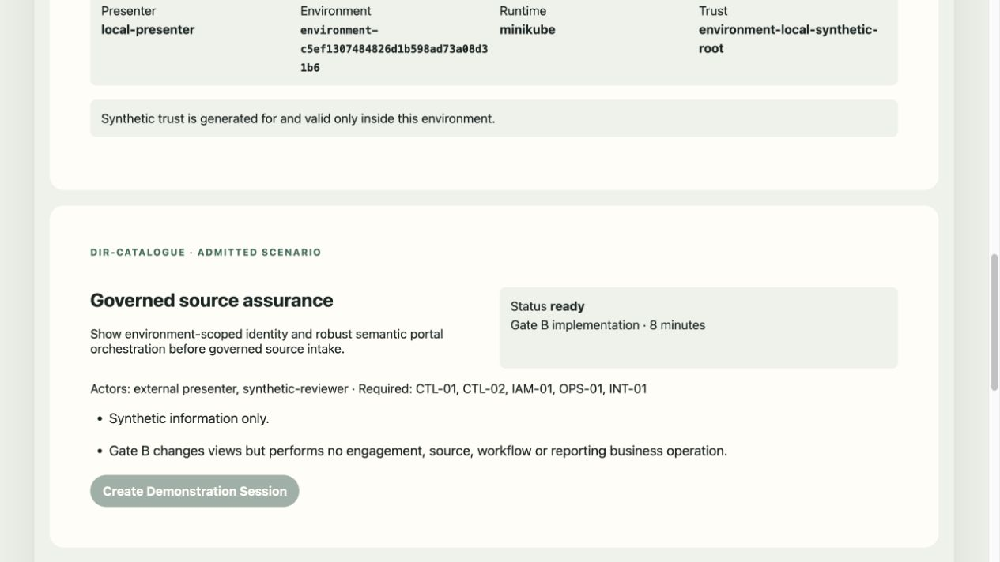

The prepared session is explicit, revisioned and governed by a bounded logical
scenario time. Presentation and Workbench are separately opened and registered
before the scenario begins.

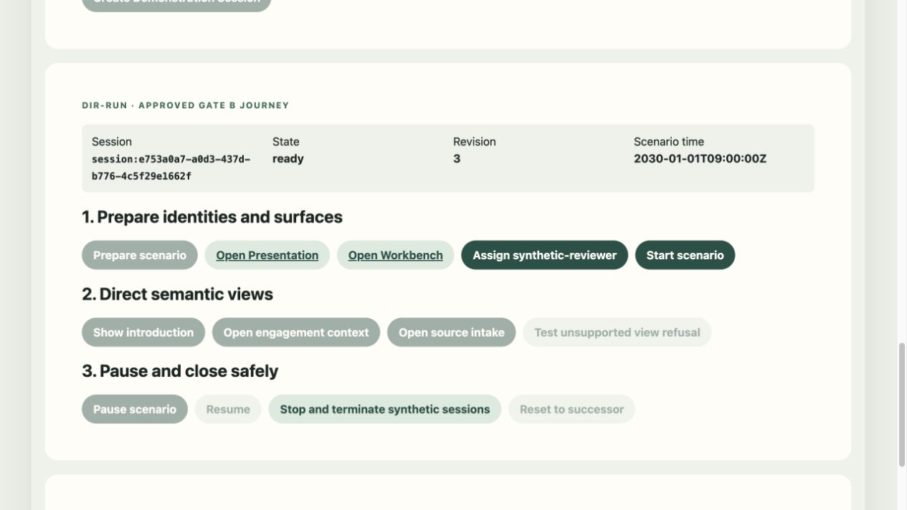

### 2. Synthetic identity without browser-held grants

The Director requests the `synthetic-reviewer` assignment through the event and
identity path. Workbench receives the resulting session binding from its own
backend and displays actor, role, trust, environment, Demonstration Session and
expiry. The signed establishment grant is not placed in the browser.

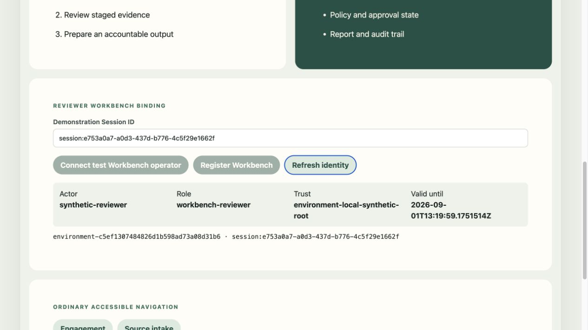

### 3. Director-controlled semantic presentation

Starting the scenario enables only the admitted semantic-view and lifecycle
commands. Surface URLs are navigation aids; the control mechanism remains
versioned events and target-owned outcomes.

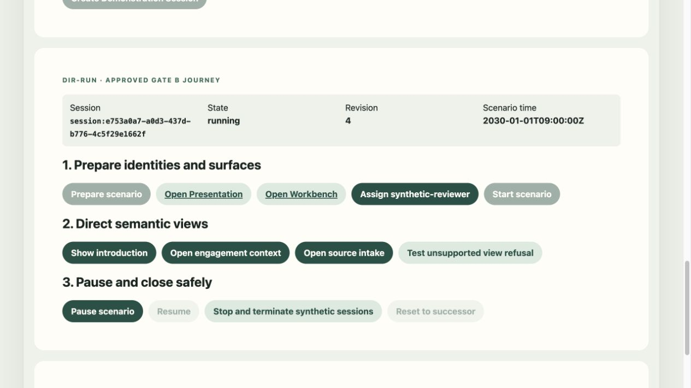

The Presentation surface resolves `PRES-INTRO` and shows purpose, actors,
desired outcome, current stage and non-claims. A visible screen records
presentation progress only; it does not prove attention, business completion or
compliance.

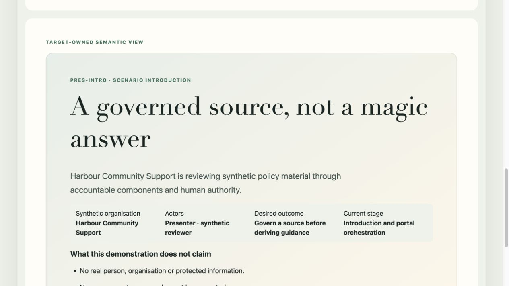

<!-- pagebreak -->

## 4. Workbench context and source-intake preview

The Workbench first resolves the synthetic engagement context. It keeps human
review authority, synthetic classification and the fact that no engagement has
been created visible.

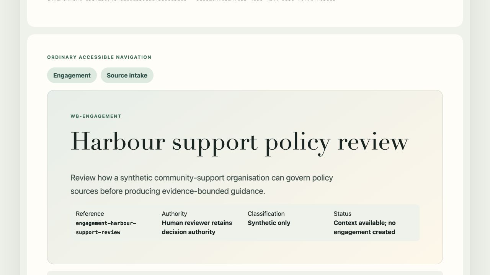

The same surface can be navigated normally by a user. Ordinary navigation emits
no Director business event and remains available for accessibility and
productive use.

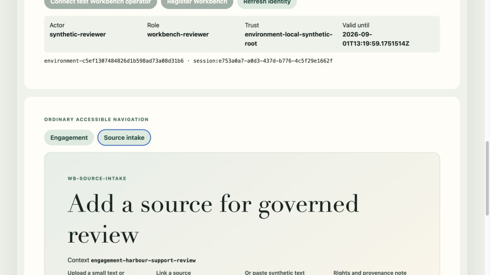

The Director can also request the same semantic view. The target owns the
screen and reports an applied view outcome. Upload, link, paste and provenance
controls are present, but submission to quarantine is held for Gate C.

Figures 6 and 8 use the clean successor as a short supplementary screen-detail
pass so the target-owned content is framed clearly. It ran on the same exact
image and environment, then stopped and reset to the final clean successor.

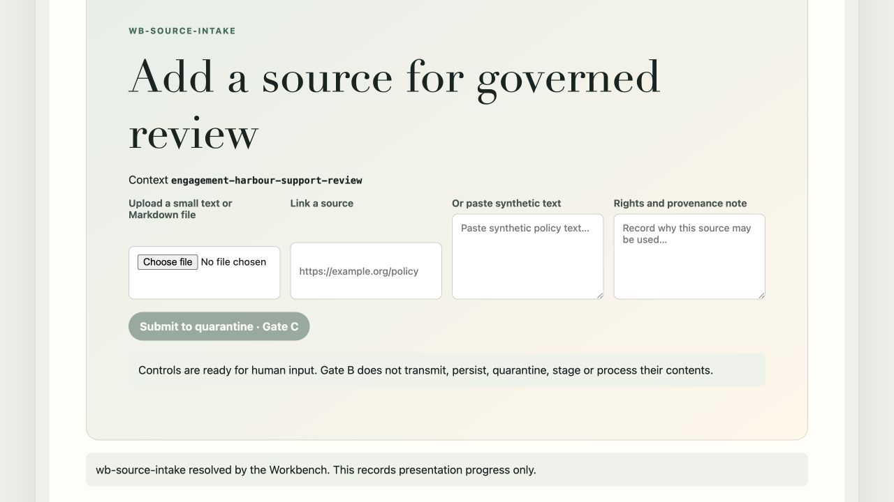

### 5. Refusal and lifecycle safety

An unadmitted semantic view fails visibly rather than being improvised or
silently accepted. The Director reports `director-operation-refused`, the API
returns HTTP 409, and Operations records `view.refused` with reason
`wb-not-admitted`.

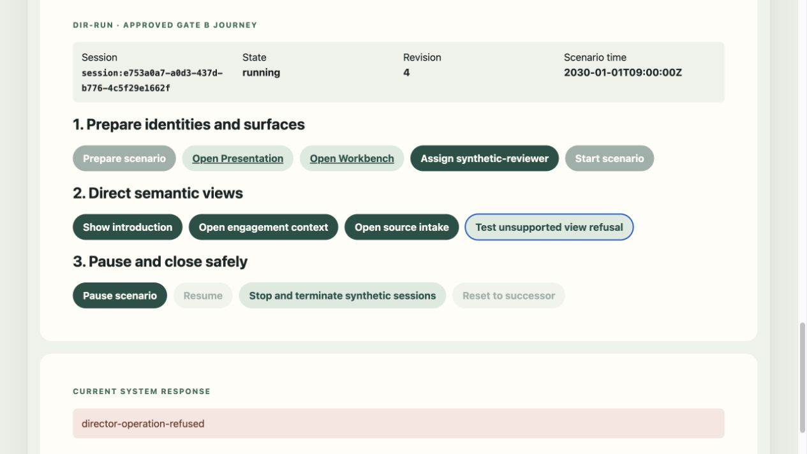

Pause changes the revisioned scenario state and disables semantic-view commands
until resume.

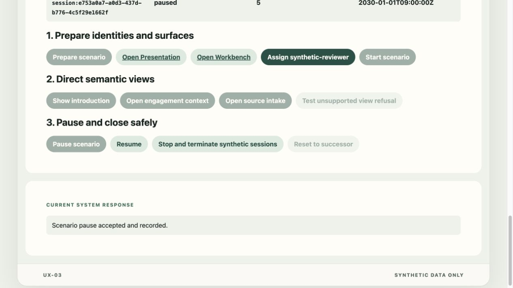

Stop terminates the synthetic application binding. Refreshing Workbench then
shows that no synthetic actor remains and disables navigation.

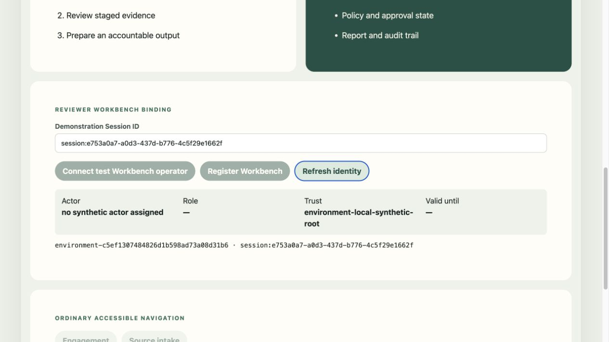

Reset creates a clean successor rather than reusing stopped scenario state. The
external presenter remains signed in, while the predecessor's synthetic
bindings, checkpoint and logical-time state are not inherited.

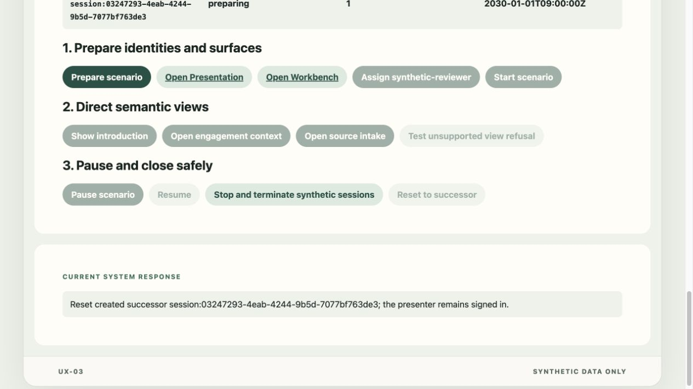

## Operations and system-test evidence

Operations correlated the evidence session across CTL-01 and CTL-02. The live
timeline captured `view.requested` and `view.applied` pairs for `pres-intro`,
`wb-engagement` and `wb-source-intake`, followed by the explicit
`view.refused` outcome.

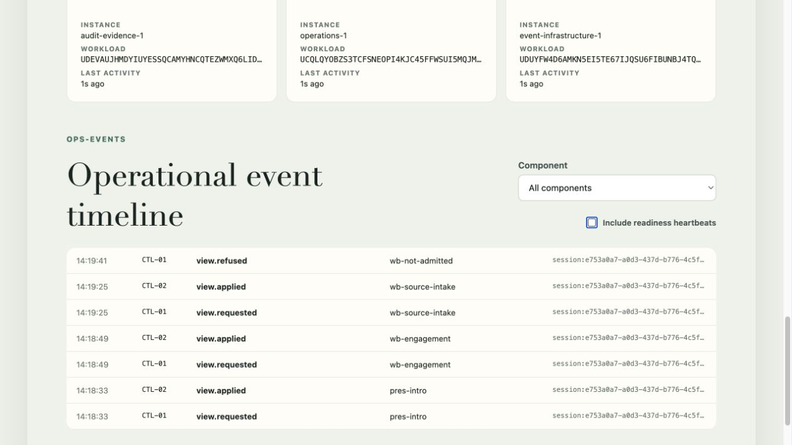

All twelve expected component instances remained ready on the exact runtime
image. The screen reports distinct component, instance and workload identities;
readiness expires if heartbeats stop.

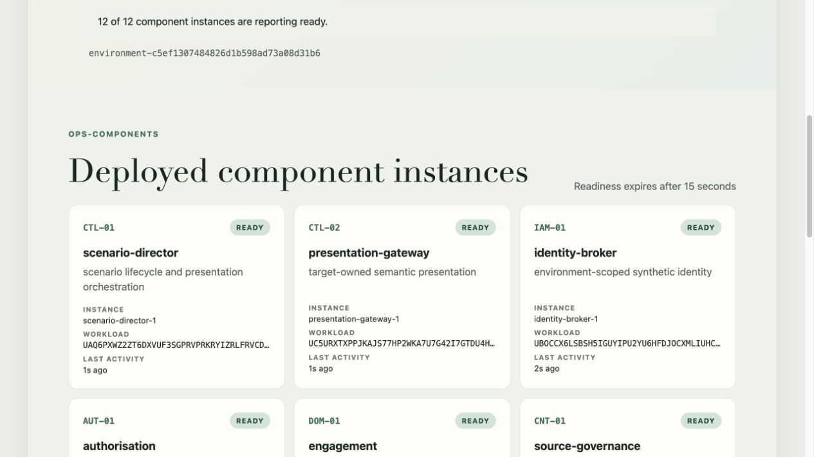

The browser walkthrough was complemented by the exact-image command-line test:

| Check                           | Evidence                                                                                                                                                                                                                                                               |
| ------------------------------- | ---------------------------------------------------------------------------------------------------------------------------------------------------------------------------------------------------------------------------------------------------------------------- |
| Gate B command-line walkthrough | Session `session:0ef7064a-f1b4-4283-83b8-3a190dcac1cb` completed the full scenario, including the unsupported-view 409, pause, stop, reset and clean successor `session:1c497771-f7da-4277-b321-e58fb1f6aa17`.                                                         |
| Gate A regression               | All twelve readiness paths and nine bounded capability commands completed under `correlation:65966786-7e45-4a85-9c9f-b91a664dd505`.                                                                                                                                    |
| Engineering checks              | Rust formatting, clippy with warnings denied, all 61 Rust tests, web type-checks, ten web tests, architecture and contract checks passed for the runtime change. Local-link, formatting, web type-check and web-test checks passed for the final local-origin binding. |

The repeated visual test exposed a real browser-session defect before this
report was completed: cookies are host-scoped rather than port-scoped, so the
three concurrent surfaces could overwrite each other's application sessions.
The baseline now uses exact, distinct local host origins: `localhost` for the
Director, `presentation.localhost` for Presentation and `workbench.localhost`
for Workbench. The runtimes use an explicit origin allowlist with no wildcard;
managed hosted profiles still reject additional origins. Fresh proof-only
aliases were admitted temporarily for the repeated capture pass and removed
afterwards so retained browser cookies could not influence the evidence.

## Functions, rules and component responsibilities delivered

| Area                        | Gate B baseline                                                                                                                                           |
| --------------------------- | --------------------------------------------------------------------------------------------------------------------------------------------------------- |
| CTL-01 Director             | Environment and catalogue evaluation; revisioned create, prepare, start, pause, resume, stop and reset; admitted semantic-view commands; explicit refusal |
| CTL-02 Presentation Gateway | Role-specific surface registration; backend cue delivery; target-owned applied, unsupported and expired outcomes; synthetic-session termination           |
| IAM-01 integration          | Signed environment- and session-bound synthetic reviewer establishment; expiry and revocation; no browser-held establishment grant                        |
| Director UI                 | Functional demonstration controls and links to Presentation, Workbench and Operations                                                                     |
| Presentation UI             | Audience-owned introduction and progress views with visible non-claims                                                                                    |
| Workbench UI                | Reviewer identity banner, engagement context, source-intake preview and ordinary accessible navigation                                                    |
| Operations UI               | Twelve-component readiness and correlated lifecycle, identity, request, outcome and refusal events                                                        |
| Event and contract rules    | Explicit command, correlation, causation, idempotency, revision, connection generation, operational expiry and conclusive outcome boundaries              |

DOM-01, CNT-01, KNO-01, WRK-01, RPT-01 and AUD-01 remain deployed walking
skeletons at this gate. Gate B does not claim that they perform engagement,
source governance, knowledge processing, workflow, reporting or durable audit
functions.

<!-- pagebreak -->

## Next gate

Gate C is authorised to implement DS-03 as the first functional business path:

| Step | DS-03 next requirement                                           |
| ---- | ---------------------------------------------------------------- |
| 1    | Accept a small synthetic upload, pasted text or permitted link.  |
| 2    | Quarantine it before any extraction or indexing.                 |
| 3    | Record provenance, rights, digest, policy and validation state.  |
| 4    | Show processing progress, logs and correlated events.            |
| 5    | Stage the accepted source for later governed retrieval.          |
| 6    | Produce the next visually verified show-and-tell report and PDF. |

Gate C should reuse the Gate B Director, identity, surface, event and Operations
contracts, changing them only where the real source-intake process produces
specific evidence that the baseline needs revision.
