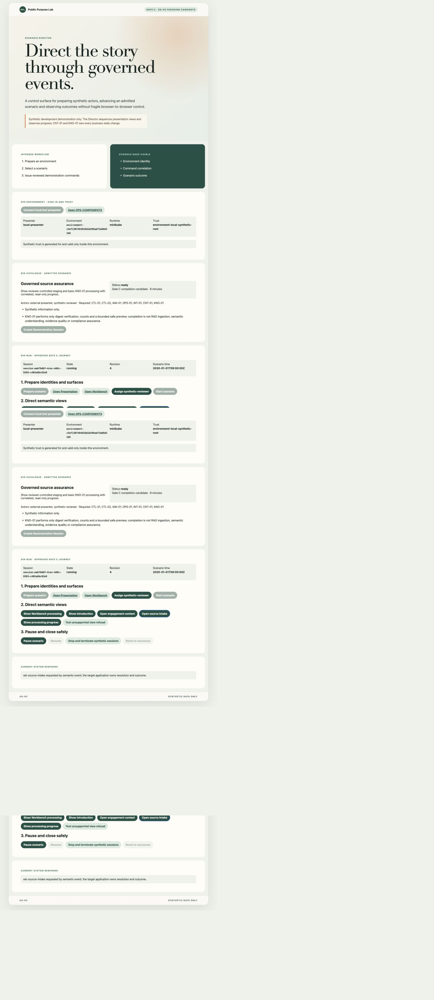
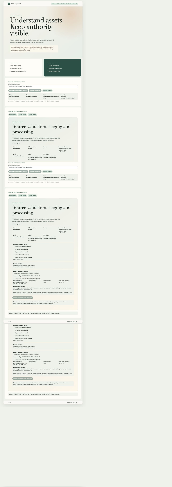
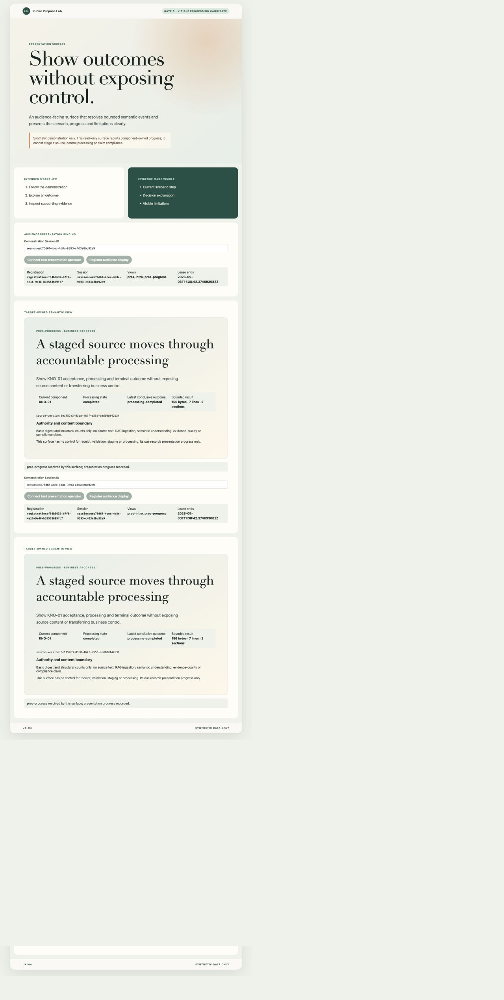
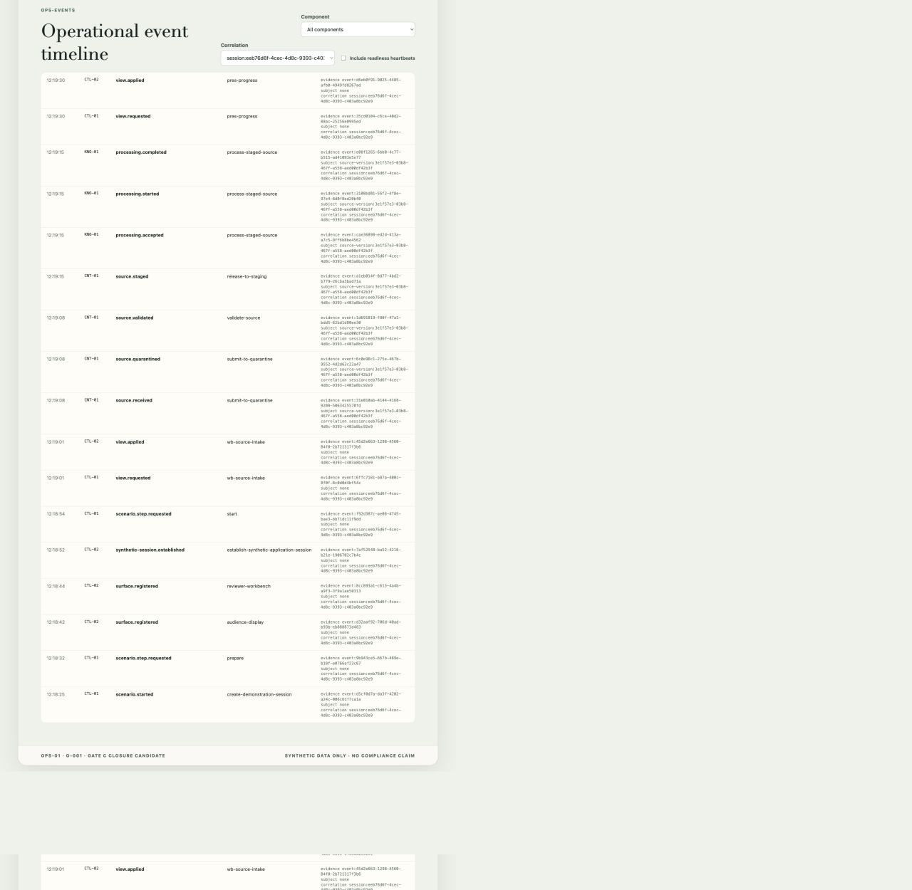

# Gate C: complete governed source processing path

**Progress report, system-test record and show-and-tell**

| Evidence field                 | Recorded value                                                                                                                                                                 |
| ------------------------------ | ------------------------------------------------------------------------------------------------------------------------------------------------------------------------------ |
| Status                         | Final - subject to review sign-off by exception                                                                                                                                |
| Delivery scope                 | Gate C completion candidate for DS-03 steps 7 and 9; `KNO-01` processing and the complete acceptance path                                                                      |
| Walkthrough                    | 3 September 2026, retained local synthetic Minikube environment                                                                                                                |
| Candidate source revision      | `1227b2c847d1cfc3d9db8860497703b9f5f4d29e+working-tree`                                                                                                                        |
| New runtime image              | `public-purpose-lab/m3-runtime:development`; `sha256:39e6b046326dbdce266c5293c3492ff60867154b2cd5ef86f7a6650ef3d1fb37`                                                         |
| Reused A-002 evidence image    | `sha256:37bbdbbe1a397270d97f2b9f1352ade3e4335b1915be589a6d98deefc671be79`; unaffected validation and staging claims only                                                       |
| Scenario package               | `1.3.0`; package `sha256:7560c52f2aa49842831e66471d0bd2af81410d34b52f2e232dd0ae911fde416b`; scenario `sha256:a8c7df534f40030f372374ca0f8fb46ad7c86308df2aacad1ff5befa9fee0ec8` |
| Environment, profile and trust | `environment-c5ef1307484826d1b598ad73a08d31b6`; `public-purpose-lab-gate-a`; environment-local synthetic root                                                                  |
| Evidence session               | `session:eeb76d6f-4cec-4d8c-9393-c403a8bc92e9`                                                                                                                                 |
| Source and processing record   | `source-version:3e1f57e3-03b8-467f-a558-aed00df42b3f`; `processing:21169089-f0f6-49bb-9ba8-b311959de286`                                                                       |
| Restarted KNO-01 pod           | `gate-a-knowledge-processing-94845588f-2fh56`; UID `419edab4-08a2-4482-b702-3bc1bdfc2211`                                                                                      |
| Clean successor                | `session:dd40a28a-3182-4080-9bd2-8abe809a4e67`; preparing                                                                                                                      |
| Publication evidence           | Implementation, report and PDF are published together; the exact commit and hosted run are recorded in the publication handoff                                                 |

> This is synthetic, in-development demonstrator evidence. It does not
> establish production, legal, regulatory, clinical, government, NHS,
> charity, evidence-quality or compliance assurance, and it does not transfer
> accountable human authority to the Lab.

## Outcome

The smallest complete Gate C finishing slice is implemented and demonstrated.
`KNO-01` consumes the durable `source.staged` fact for one exact immutable
source version, records receipt idempotently in its own persistent store and
emits `processing.accepted`, `processing.started` and one conclusive
`processing.completed` or `processing.failed` outcome. Processing is
deliberately elementary: it verifies the digest, counts bytes, lines and
Markdown-like sections, and creates a bounded safe preview for the authorised
Workbench.

The source body crosses only the protected `CNT-01` to `KNO-01` processing
input boundary. It is absent from lifecycle events, general logs, Operations
and Presentation. Presentation receives read-only progress, structural counts
and explicit limitations; it has no command that can submit, validate, stage
or process a source. The named reviewer remains responsible for the release
request and no processing result is treated as approval of evidence or a
finding.

The walkthrough reused the already accepted A-002 validation and
reviewer-controlled staging behaviour. Its evidence is recorded in
`gate-c-validation-and-staging-show-and-tell.md` and was not recreated. The new
image and the evidence below cover only the additional KNO-01 runtime,
projections, restart behaviour and complete DS-03 acceptance path.

<!-- pagebreak -->

## Acceptance summary

| Gate C finishing requirement                                                | Evidence                                                                            | Position |
| --------------------------------------------------------------------------- | ----------------------------------------------------------------------------------- | -------- |
| Consume the exact immutable staged-source fact                              | K-001 contract, component tests, Figures 2 and 4                                    | Achieved |
| Record idempotent receipt and visible accepted, started and terminal states | Persistent KNO-01 store, Figures 2 and 4                                            | Achieved |
| Keep processing basic and inspectable                                       | Digest verification, 156 bytes, 7 lines, 2 sections and bounded preview in Figure 2 | Achieved |
| Keep source bodies inside the authorised component boundary                 | Event, log and Presentation absence assertions; Figures 3 and 4                     | Achieved |
| Show processing state and bounded result in Workbench                       | Figure 2                                                                            | Achieved |
| Show meaningful read-only progress in Presentation                          | Figure 3                                                                            | Achieved |
| Show correlated CNT-01 to KNO-01 timings and safe evidence references       | Figure 4                                                                            | Achieved |
| Reconcile after KNO-01 restart without a second terminal result             | Rollout restart, persistent processing identity and terminal count in Figure 5      | Achieved |
| Prevent refused or unvalidated sources reaching KNO-01                      | Contract and end-to-end adverse cases                                               | Achieved |
| Preserve component-owned semantics for upload and paste                     | End-to-end paste and upload paths                                                   | Achieved |

<!-- pagebreak -->

## Walkthrough flow

### 1. Director starts the admitted Gate C path

The Director evaluated the retained synthetic environment, created the
Demonstration Session, prepared the admitted scenario, established the
synthetic reviewer and audience bindings, and started DS-03. It then requested
the target-owned Workbench source-intake view. The Director coordinates the
story; it does not perform or overwrite CNT-01 or KNO-01 business operations.



<!-- pagebreak -->

### 2. Workbench shows the bounded processing result

The reviewer used paste intake for a synthetic Markdown fixture and released
the exact validated version through the existing A-002 path. Workbench then
showed the KNO-01 record and its accepted, processing and completed stages. The
single result verified digest
`77db273194d2999b13a03a647da8152a2d0440d87c7ead6307ce5f980d5b1fcd`,
counted 156 bytes, 7 lines and 2 sections, and returned a bounded preview only
to this authorised reviewer surface.



<!-- pagebreak -->

### 3. Presentation reports progress without control or content

The Director requested `PRES-PROGRESS`. Presentation resolved the target-owned
view from the component state and displayed `KNO-01`, `completed` and the three
structural counts. It exposed neither the source body nor the preview and
offered no business-operation control. The limitation explicitly rules out
RAG ingestion, semantic understanding, evidence quality and compliance.



<!-- pagebreak -->

### 4. Operations shows the correlated component sequence

Operations projected the complete sequence under correlation
`session:eeb76d6f-4cec-4d8c-9393-c403a8bc92e9`: CNT-01 receipt, quarantine,
validation and staging, followed by KNO-01 acceptance, start and completion.
Each row includes timestamp, component, event type, safe event reference and
exact source-version subject. No event contains source content. Refused paths
use the same safe projection and are covered by the adverse system tests.



<!-- pagebreak -->

### 5. Restart reconciliation preserves one conclusive result

The `gate-a-knowledge-processing` deployment was restarted after completion.
Kubernetes replaced the workload and reported the new pod ready with the same
image digest. KNO-01 reopened its retained SQLite state, reconciled the staged
work and returned the same processing identity, original stage timestamps and
`Terminal results: 1`. It did not emit or record a second completion.

```text
deployment.apps/gate-a-knowledge-processing restarted
deployment "gate-a-knowledge-processing" successfully rolled out
new pod UID: 419edab4-08a2-4482-b702-3bc1bdfc2211
processing record: processing:21169089-f0f6-49bb-9ba8-b311959de286
terminal results after restart: 1
```


<!-- pagebreak -->

## Adverse, contract and component evidence

| Evidence layer    | Conclusive checks                                                                                                                                            |
| ----------------- | ------------------------------------------------------------------------------------------------------------------------------------------------------------ |
| K-001 contract    | Versioned content query, protected response, lifecycle fact and status projections; duplicate-terminal fixture rejected                                      |
| KNO-01 component  | Exact-source idempotency, reopen reconciliation, one terminal result, bounded completed result and safe disclosed failure                                    |
| CNT-01 component  | Only the exact staged version is returned to the environment-bound KNO-01 purpose; wrong session, caller or lifecycle is refused                             |
| End-to-end paste  | Quarantine, validation, staged fact, accepted, started, completed, bounded result and one terminal outcome                                                   |
| End-to-end upload | The same component-owned lifecycle and terminal semantics as paste                                                                                           |
| Refusals          | Empty, malformed, NUL-containing, oversized and hostile fixtures do not reach KNO-01; an unvalidated staging attempt is refused and has no processing record |
| Failure           | A disclosed synthetic processing-failure fixture reaches one safe `processing.failed` result without body disclosure                                         |
| Privacy           | Exact fixture body absent from Operations events, Presentation responses and CNT-01/KNO-01 general logs                                                      |
| Restart           | Real Minikube rollout restart returns the same processing identity with terminal count one                                                                   |

The retained Minikube node exhausted its image filesystem during the candidate
rebuild. Unused build images were pruned with the container runtime's standard
image-prune operation; persistent volumes, the environment trust material and
retained business state were not removed. The affected SQLite-owning workloads
then recovered. This is an operator-capacity lesson, not a source-processing
failure or a reason to weaken fail-closed persistence behaviour.

## Functions, rules and contracts delivered

| Area                    | Current Gate C baseline                                                                                                |
| ----------------------- | ---------------------------------------------------------------------------------------------------------------------- |
| `KNO-01`                | Component-owned persistent receipt, lifecycle, bounded processor, transactional outbox and startup reconciliation      |
| `K-001`                 | Versioned protected-content query and metadata-only lifecycle/status contracts with examples and negative fixtures     |
| `CNT-01`                | Exact staged-body response restricted to the authorised KNO-01 environment, session and processing purpose             |
| Workbench `UX-02`       | Lifecycle stages, exact processing record, one terminal count, digest/count result, bounded preview and limitations    |
| Presentation `UX-04`    | Read-only component progress and structural counts with no source text, preview or business controls                   |
| Operations `OPS-01`     | Correlated CNT-01 to KNO-01 lifecycle, timings, refusals and safe event/subject references                             |
| `INT-01` and deployment | Durable Gate C subjects, KNO-01 identity permissions and a Kubernetes persistent processing-state volume               |
| Assurance               | Paste/upload parity, adverse-input exclusion, failure path, content-absence assertions and real restart reconciliation |

No new ADR was required. The slice uses the existing component mesh, versioned
event envelope, environment-scoped workload identity, NATS JetStream,
component-owned SQLite persistence and Kubernetes deployment conventions. It
adds a contract and persistent volume only where the demonstrated KNO-01 path
needs them; it does not create a new platform or technology commitment.

## Gate position

The implementation and local evidence satisfy the complete DS-03 Gate C
acceptance path. Publication and a successful exact-commit hosted quality gate
complete the engineering evidence. Formal Gate C closure remains a founder
governance action under review by exception; this report does not pre-empt that
sign-off.
