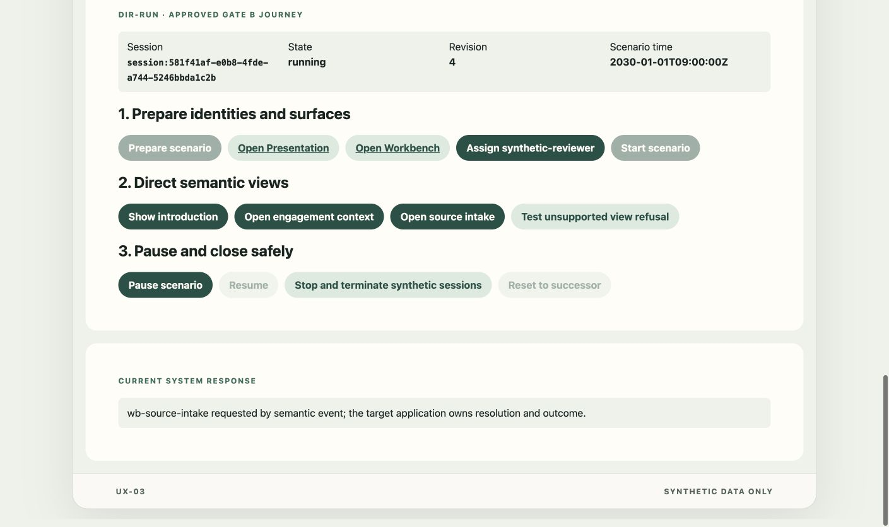
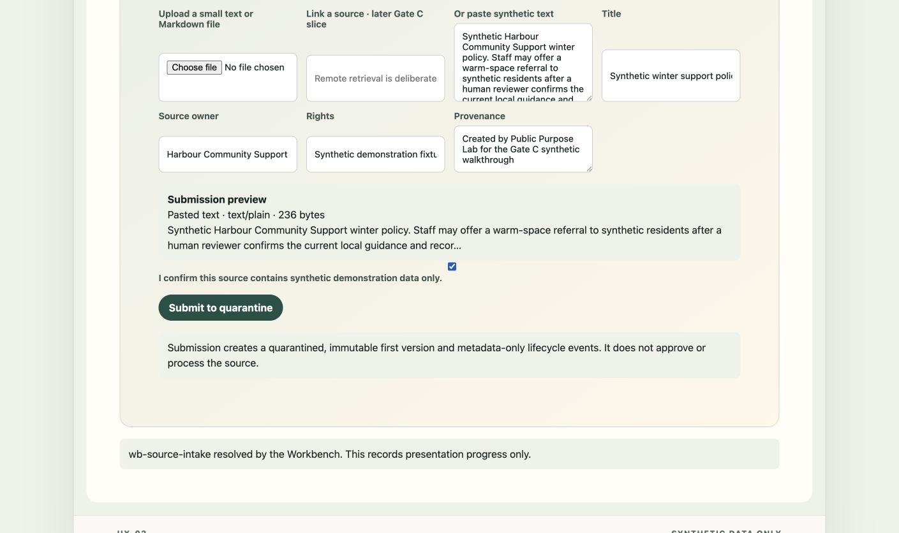
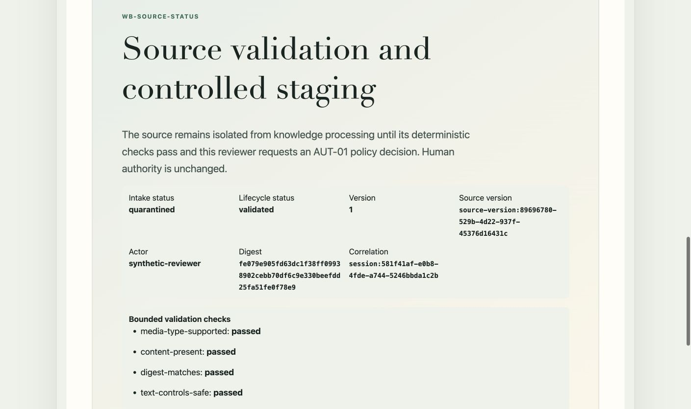
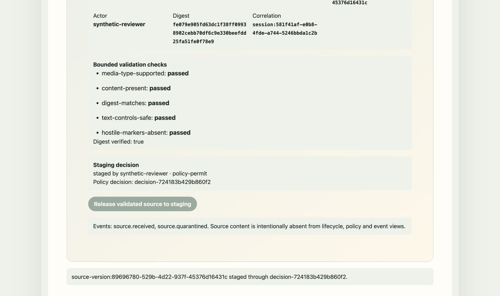
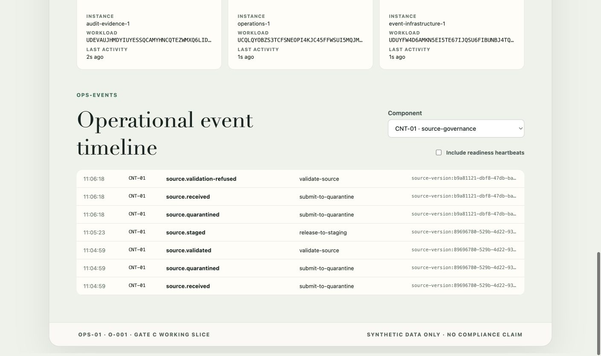
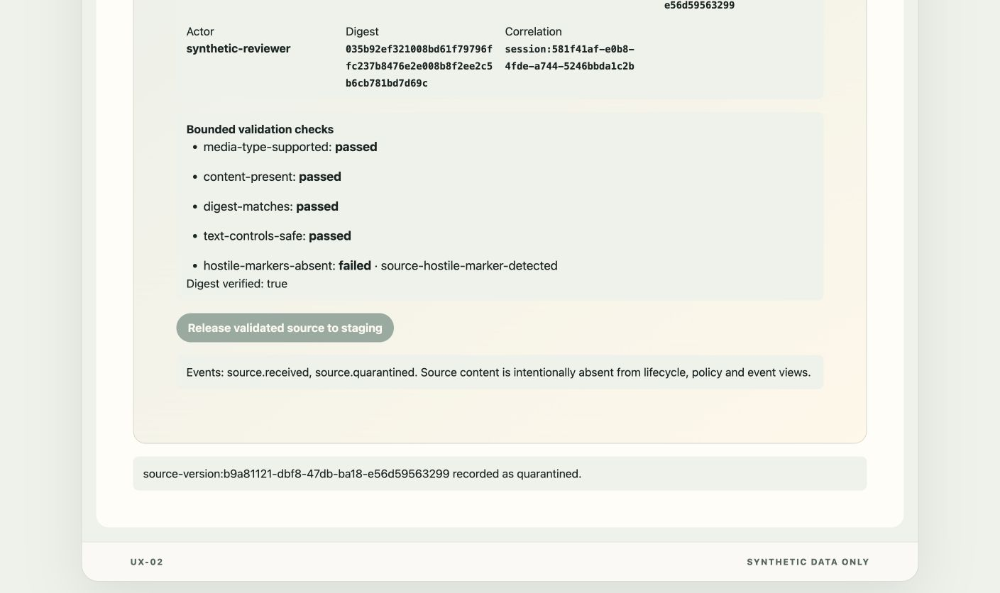
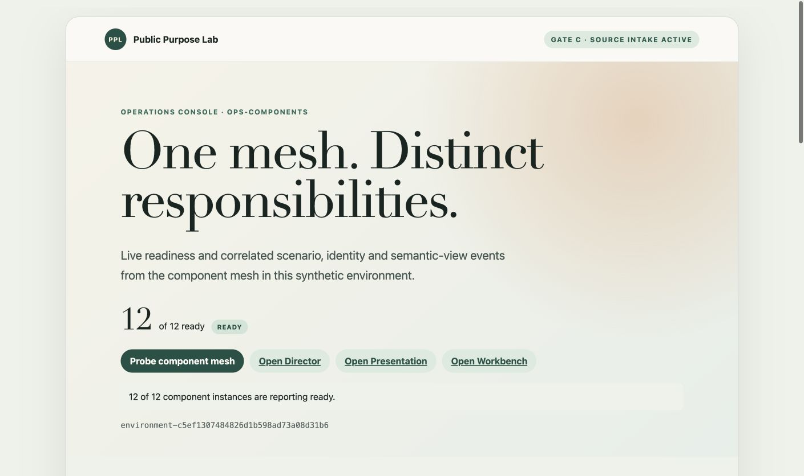

# Gate C: source validation and staged release

**Progress report, system-test record and show-and-tell**

| Evidence field                 | Recorded value                                                                                    |
| ------------------------------ | ------------------------------------------------------------------------------------------------- |
| Status                         | Final - subject to review sign-off by exception                                                   |
| Delivery scope                 | `A-002` validation and staging slice; Gate C remains active                                       |
| Walkthrough                    | 3 September 2026, local synthetic Minikube environment                                            |
| Published implementation       | `292f56538a4272b2122cf17fbbb15ef7ca3b4dbd`                                                        |
| Deployed build provenance      | `30acae4c340b09111d1c22cb720ac2186bc7a117+working-tree` candidate                                 |
| Runtime image and digest       | `development`; `sha256:37bbdbbe1a397270d97f2b9f1352ade3e4335b1915be589a6d98deefc671be79`          |
| Exact-source hosted check      | Run `33739198538`; successful for published implementation                                        |
| Environment, cluster and trust | `environment-c5ef1307484826d1b598ad73a08d31b6`; `public-purpose-lab-gate-a`; local synthetic root |

> This is synthetic, in-development demonstrator evidence. It does not
> establish production, legal, regulatory, clinical, evidence-quality,
> malware-clearance or compliance assurance, and it does not transfer
> accountable human authority to the Lab.

## Outcome

The approved `A-002` slice now makes source validation and release to staging
visible as a real, component-owned business path. A named synthetic reviewer
can submit reviewed text, see an immutable source version quarantined, inspect
five deterministic checks, and request staging. `CNT-01` obtains an exact
protected-action decision from the separately deployed `AUT-01`, records the
outcome and emits metadata-only lifecycle facts. Operations displays the
successful and refused paths under the same Demonstration Session.

This report corrects the missing evidence pack for the already published
implementation. The validated runtime image was deliberately reused: the
correction changes documentation and evidence, not the walked behaviour,
presentation, contracts or security boundary. Rebuilding would create a new
fingerprint without adding assurance. The table records both the image's
actual candidate-build label and digest and the implementation revision into
which that candidate was published.

The evidence session was `session:581f41af-e0b8-4fde-a744-5246bbda1c2b`.
It was stopped and reset to clean successor
`session:7cdb6638-18dc-4de0-b1e1-8fa34f2155d4` after capture.

<!-- pagebreak -->

## Acceptance summary

| Approved flow requirement                              | Walkthrough evidence       | Position |
| ------------------------------------------------------ | -------------------------- | -------- |
| Director requests the target-owned source-intake view  | Figure 1                   | Achieved |
| Reviewer sees content and provenance before submission | Figure 2                   | Achieved |
| `CNT-01` quarantines one immutable version             | Figure 3                   | Achieved |
| Five bounded validation checks are visible             | Figures 3 and 4            | Achieved |
| Named reviewer requests an exact `AUT-01` decision     | Figure 4                   | Achieved |
| Lifecycle facts are correlated and content-free        | Figure 5                   | Achieved |
| Hostile-marker validation fails closed                 | Figures 5 and 6            | Achieved |
| Twelve shared component instances remain ready         | Figure 7; inherited Gate A | Achieved |
| `KNO-01` processing begins only in the next slice      | Explicit limitation        | Pending  |

<!-- pagebreak -->

## Walkthrough flow

### 1. Director starts the governed path

The Director ran the admitted synthetic scenario and requested
`WB-SOURCE-INTAKE` through the event path. The semantic command changes the
target view only; it does not claim source receipt, validation or staging.

<!-- pagebreak -->

### 2. Reviewer checks the source before submission

Workbench showed paste mode, media type, byte count, preview, title, owner,
rights and provenance before any business submission. The reviewer explicitly
confirmed that the fixture was synthetic. Remote retrieval remained disabled.

<!-- pagebreak -->

### 3. Quarantine and deterministic validation

`CNT-01` recorded immutable version
`source-version:89696780-529b-4d22-937f-45376d16431c`. Workbench returned
status and metadata without returning the body. Media type, content presence,
digest, text-control and hostile-marker checks all passed, leaving the version
eligible for a reviewer-controlled staging request.

<!-- pagebreak -->

### 4. Reviewer-controlled release through `AUT-01`

The synthetic reviewer requested release of the exact validated version.
`AUT-01` permitted that actor, role, purpose, action and resource combination;
`CNT-01` then recorded `staged` with policy decision
`decision-724183b429b860f2`. Staging is not approval of a finding or report.

<!-- pagebreak -->

### 5. Correlated operational facts

Operations showed `source.received`, `source.quarantined`,
`source.validated` and `source.staged` for the successful version. It also
showed receipt, quarantine and `source.validation-refused` for the adverse
fixture. The events expose identifiers, action and outcome, not source content.

<!-- pagebreak -->

### 6. Adverse input fails closed

A second synthetic fixture contained a disclosed hostile marker. Its immutable
version remained quarantined, the `hostile-markers-absent` check failed with
safe reason `source-hostile-marker-detected`, and release to staging remained
disabled. This is a small deterministic safeguard, not a general malware or
content-moderation claim.

<!-- pagebreak -->

## Common platform context

The Gate A mesh remained available throughout the walkthrough: all twelve
component instances reported ready. Gate B's Director, Presentation Gateway,
synthetic identity, semantic-view and lifecycle controls were reused without a
new orchestration mechanism. Gate C added real behaviour only where the source
path required it.

## Functions, rules and contracts delivered

| Area                       | Current baseline                                                                                               |
| -------------------------- | -------------------------------------------------------------------------------------------------------------- |
| Workbench `UX-02`          | Paste/upload preview, required provenance, synthetic confirmation, status, checks and staging UI.              |
| Source governance `CNT-01` | Immutable quarantine, digest, deterministic validation, lifecycle state, idempotency and outbox.               |
| Authorisation `AUT-01`     | Exact `AZ-001` decision for actor, role, purpose, action and source-version resource.                          |
| Operations `OPS-01`        | Correlated metadata-only success and refusal lifecycle projection.                                             |
| Events `INT-01`            | Durable `source.received`, `quarantined`, `validated`, `validation-refused` and `staged` facts.                |
| `A-001` and `A-002`        | Authenticated intake/quarantine followed by separately authorised staged-source release.                       |
| Security and privacy       | Environment-bound synthetic reviewer; browser cannot assert protected fields; source body stays with `CNT-01`. |

The exact-source hosted check passed contract catalogues and fixtures, Rust
formatting, linting and tests, frontend type checks and tests, architecture
checks, and end-to-end smoke coverage including exact retry, changed-input
idempotency refusal, hostile-marker refusal and staging refusal. The browser
walkthrough added real screen and event evidence; it did not repeat unaffected
Gate A or Gate B qualification.

## Remaining Gate C work

Gate C is not closed by this slice. The next bounded increment is DS-03 step 7
and step 9: `KNO-01` must consume the staged-source fact, record idempotent
receipt, emit `processing.started`, perform only the approved basic text
processing, emit a terminal outcome, and visibly reconcile after restart
without a duplicate completion. Workbench, Presentation and Operations must
show that lifecycle. Only then can the complete DS-03 path be walked and Gate C
closure considered.

| Next acceptance step    | Required visible proof                                                         |
| ----------------------- | ------------------------------------------------------------------------------ |
| Consume staged source   | One `KNO-01` receipt tied to the immutable source version and correlation.     |
| Process bounded text    | Queued, started and terminal states on Workbench, Presentation and Operations. |
| Reconcile after restart | Readiness returns and no duplicate terminal result is created.                 |
| Consider Gate C closure | Complete DS-03 path, adverse cases and final show-and-tell are walked.         |
