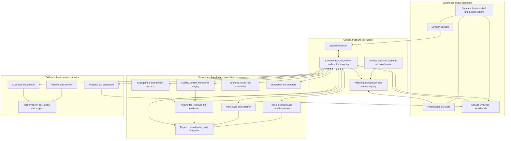

# Public Purpose Lab conceptual architecture framework

Status: Agreed conceptual framework

Last reviewed: 25 August 2026

## Purpose

This document defines the enduring conceptual architecture for Public Purpose
Lab. It translates the [agreed roadmap](../programme/roadmap.md) into a coherent
framework for the **Service Evidence Workbench**, **Scenario Director** and
controlled **Presentation Surfaces**, supported by common service, trust,
evidence and operating capabilities.

The framework defines responsibilities, boundaries and contract expectations.
It does not select products, make every logical component a service, or claim
that the proposed portfolio integrations already exist. It guides the detailed
logical and deployment blueprint, threat models, architecture decisions and an
implementation plan.

## Framework vision

The Lab will provide one portable framework in which a practitioner can:

1. establish a bounded discovery or improvement engagement;
2. link or upload governed source assets;
3. stage, query and analyse those sources without confusing generated material
   with accepted evidence;
4. map relationships, assess change, govern findings and commission human work;
5. create reports, analytical visualisations and declarative diagrams whose
   inputs and provenance remain inspectable; and
6. demonstrate the complete business story repeatedly through controlled,
   event-driven presentation surfaces.

The same logical architecture should run as a private local installation on
macOS, Linux or Windows, as a portable demonstration environment, and as a
Kubernetes-compatible hosted environment. These are deployment profiles of one
framework, not separate products with different trust or evidence standards.

The framework supports evidence, workflow and reporting. It does not itself
hold legal, regulatory, clinical or other professional accountability. Where
such interpretation or authority is required, an appropriately qualified
person or partner owns it; the framework records their sources, work and
decisions.

## Core concepts

| Concept | Meaning |
|---|---|
| **Service Evidence Workbench** | The productive practitioner and client surface for engagements, assets, analysis, governed work, visualisation and evidence-linked reporting. |
| **Scenario Director** | The control component that prepares, starts, pauses, resets and observes synthetic scenarios, issues authorised commands and verifies checkpoints. It does not make domain decisions. |
| **Director Console** | The presenter-facing user interface to the Scenario Director. |
| **Presentation Surface** | A registered screen or browser session that can apply semantic presentation cues and display a component view without exposing its routes to the Director. |
| **Demonstration Session** | A bounded, identified execution that links scenario state, synthetic users, screens, commands, events, evidence and reset behaviour. |
| **Presentation Cue** | A short-lived, typed request to show a named business view or state. It describes intent, not a URL or browser action. |
| **Demonstration Sign-In Grant** | A signed, short-lived and single-use request for a registered surface to establish a session as an authorised synthetic user. It is not a password or reusable bearer credential. |
| **Asset** | A registered document, policy, guidance item, system description, data extract, note or link with ownership, provenance, classification and lifecycle. |
| **Evidence** | Traceable material connecting a source, action, transformation, rule, model-assisted step or human decision to a finding or output. |
| **Work item** | A durable assignment to a person or role with authority, state, deadlines, outcomes and history. |
| **Semantic view** | A stable presentation capability such as `engagement.asset-register` or `work.queue`, resolved by the receiving component to its current interface. |

## Architecture principles

1. **Business intent, not browser mechanics.** The Director controls a
   demonstration through typed commands, events and semantic presentation cues,
   never through embedded routes, simulated clicks or knowledge of another
   frontend's navigation.
2. **Commands request; events report facts.** A command may be accepted,
   refused or fail. An event describes an accepted fact. Presentation cues and
   operational telemetry do not masquerade as business events.
3. **Components retain authority.** The Director may request and observe, but
   each domain component validates authority, owns its state and reports its
   own decisions.
4. **Signed authority replaces ambient trust.** Human, synthetic and workload
   identities have explicit, bounded trust paths. Possession of a link or
   access to an event channel does not confer authority.
5. **Synthetic identity is visibly and environmentally isolated.** Each
   environment has its own synthetic trust root, users, roles and data realm.
   Reusing an actor name in another environment does not create the same
   security principal or allow trust to cross between them.
6. **One logical architecture, several deployment profiles.** Local and hosted
   forms share concepts, contracts, policy and evidence expectations.
7. **Logical boundaries precede physical separation.** Early deployments may
   combine responsibilities, but ownership, interfaces, trust and failure
   behaviour remain explicit.
8. **Evidence is designed in.** Provenance, correlation, decisions, failure,
   recovery, model use and human release are reconstructable across an
   end-to-end path.
9. **Operational truth and analytics are distinct.** Components own business
   state; analytical projections are reproducible interpretations of events and
   records, not a back door for changing them.
10. **Sources, generated analysis and approved decisions remain distinct.** A
    retrieved passage or generated finding cannot silently become active policy
    or operational fact.
11. **Human authority remains visible.** Consequential release, approval,
    refusal, escalation and override are attributable to an authorised person.
12. **Replaceable implementations.** Identity providers, event transports,
    stores, model providers, diagram renderers and deployable units may change
    without changing the enduring responsibility model.
13. **Security, privacy and operability are component behaviour.** Purpose,
    classification, least privilege, retention, health and recovery are part of
    every contract rather than later platform additions.
14. **Reuse follows evidence.** Public Purpose Lab applies the Architecture
    Portal blueprint, tests it through scenarios, and offers reusable contracts
    and lessons back to the portfolio without overstating their maturity.

## Conceptual blueprint

The blueprint is logical. A box names an owned responsibility, not necessarily
a process, container, database or Kubernetes workload.

The first implementation should realise the smallest complete path through this
model. It should not scaffold every box as an independently deployed service.

## Experience and control surfaces

### Service Evidence Workbench

The Workbench is the principal working environment, not merely a dashboard. It
should provide a clean, accessible and keyboard-efficient interface with clear
status, provenance, uncertainty and decision authority.

Its conceptual work areas are:

- **engagement context** — purpose, authority, participants, scope, status and
  outputs;
- **asset inbox and register** — link or upload sources, capture metadata and
  inspect validation, versions, classifications, rights and retention;
- **staging and source review** — quarantine, validation, extraction,
  provenance, conflict and release state;
- **query and evidence review** — bounded questions, cited passages, claims,
  gaps, uncertainty and source comparison;
- **relationship explorer** — systems, people, responsibilities, information,
  findings, sources and dependencies as inspectable nodes and edges;
- **analytical views** — governed measures, trends, distributions and
  comparisons derived from versioned data and event projections;
- **diagram and report studio** — report composition and source-controlled
  architecture, process or system diagrams;
- **work and decisions** — assignments, review, approval, refusal, escalation,
  completion and history; and
- **evidence and release** — preview, accountable release, limitations,
  evidence manifest and retained output.

The framework distinguishes three visual forms:

1. a **relationship graph** shows entities, connections, lineage and impact;
2. an **analytical visualisation** shows measures through charts and tables;
3. a **declarative diagram** renders maintained diagram source into an
   architecture, process or system view.

Diagram generation must use a replaceable renderer contract. Mermaid and
PlantUML are initial candidates, not framework commitments. The retained record
includes the diagram source, input evidence, renderer and version, generated
artifact, author or generator, and release status.

### Scenario Director and Director Console

The Scenario Director owns demonstration coordination. It may:

- prepare and reset synthetic data and controlled component state;
- start, pause, resume and stop a scenario;
- issue authorised business commands without bypassing the receiving component;
- issue presentation cues to registered surfaces;
- request synthetic sign-in for a named demonstration user and surface;
- control scenario time and approved fault injection;
- observe commands, events, checkpoints, refusals, failures and recovery; and
- assemble the resulting demonstration evidence pack.

It does not own work, policy, domain records, identity decisions or report
approval. A scenario definition should be usable for a live presentation,
automated acceptance test, replay and adversarial assurance.

The Director Console shows the presenter the current scene, registered screens,
component readiness, synthetic participants, pending cues, checkpoints and
failures. Presenter controls remain distinguishable from business actions.

### Presentation Surface and semantic control

Each presentation-capable component publishes a versioned capability manifest
containing stable semantic view identifiers, accepted context and presentation
constraints. It does not publish internal routes as an integration contract.

A Presentation Surface registers itself and its capabilities for one
Demonstration Session. The Director issues a semantic cue to a named screen or
screen role. The Presentation Gateway validates and delivers the cue; the
receiving component resolves it to its current interface and reports that it
was applied, refused, unsupported, expired or failed.

Presentation cues are short-lived and traceable. They may change what a screen
shows, but they do not change business state. Where the story requires a
business action, the Director issues a separately authorised business command
to the owning component.

## Identity and trust model

The framework has three deliberately separate identity paths:

- **external human identity** — real users authenticate through a configured
  external identity provider and receive roles appropriate to the environment;
- **synthetic demonstration identity** — known synthetic users receive bounded
  sessions only through the demonstration trust mechanism; and
- **workload identity** — components authenticate to one another with
  environment-specific, least-privilege credentials.

### Synthetic sign-in contract

The event infrastructure must support a signed `Demonstration Sign-In Grant`
with these enduring properties:

1. Environment setup creates a unique environment identity and a dedicated
   synthetic root certificate and key pair inside that environment. The root
   is not imported from or reused by another local, demonstration or hosted
   environment.
2. Root and signing private keys remain inaccessible outside the environment
   to the strongest protection reasonably available on that platform,
   preferably through non-exportable or environment-managed key storage. They
   are never included in application images, scenario packs, source control,
   logs or routine exports.
3. The root certificate is distributed only where needed as the environment's
   trust anchor. Although the public certificate is not secret, no other
   environment accepts it as a synthetic identity authority. Subordinate or
   leaf signers can be restricted, rotated and revoked independently.
4. The Scenario Director requests the grant through a separately controlled
   demonstration signing authority. That authority signs it with an identity
   chained to the environment's synthetic root.
5. The grant identifies its issuer and environment, target application and
   surface, Demonstration Session, synthetic user and role, issued and valid
   times, unique nonce, purpose and correlation context.
6. The receiving backend identity boundary validates the certificate chain,
   signer permission, audience, environment, synthetic-user registry, time
   window and one-time use. A portal frontend does not validate or exchange the
   grant itself.
7. An accepted grant establishes an ordinary secure application session marked
   as synthetic and bound to the registered surface. The signed grant is not
   placed in a URL, retained as a reusable bearer token or exposed to page
   content.
8. Synthetic signers can authorise only synthetic identities and synthetic
   roles. Synthetic identities can access only the corresponding isolated data
   realm and cannot be promoted into external human or production identities.
9. A scenario may use the same synthetic actor names in several environments
   so that demonstrations remain consistent. The security principal still
   includes the environment identity and issuer, so a grant, credential or
   session from one environment is invalid in every other environment.
10. Acceptance, refusal, expiry, replay, revocation and session termination are
   auditable facts available to the Director and support views without exposing
   credential material.

The detailed certificate profile, signing service, transport, session binding,
key custody, rotation and revocation mechanisms require a threat model and an
accepted architecture decision before implementation. The properties above are
the stable contract that those choices must preserve.

## Common interaction model

The framework uses a shared interaction model while keeping business facts,
presentation control, analytics and telemetry distinct.

### Message profiles

| Profile | Purpose | Durability expectation |
|---|---|---|
| **Business command** | Requests an authorised change from the component that owns it. | Durable until accepted, refused or safely expired. |
| **Business event** | Reports an accepted domain or work fact. | Durable, replayable and governed by retention. |
| **Demonstration control** | Controls scenario state, synthetic setup, checkpoints or faults. | Durable and auditable within the demonstration evidence. |
| **Trust command** | Requests a bounded synthetic session or other trust action under signed authority. | Retained sufficiently to prevent replay and prove the outcome, without retaining usable credential material. |
| **Presentation cue** | Requests a semantic view on a registered surface. | Short-lived, acknowledged and traceable; not business truth. |
| **Operational signal** | Reports component health, readiness or diagnostic state. | Retained according to operational need, not business-record rules. |
| **Analytical projection** | Reproducibly interprets accepted facts for measures and views. | Rebuildable from governed sources and versioned definitions. |

Every public command or event envelope provides, where applicable:

- message identity, type and schema version;
- issuer or actor, authority, audience and target;
- engagement, scenario or Demonstration Session context;
- issued, occurred and expiry times;
- correlation, causation, idempotency and trace context;
- purpose and information classification;
- payload and contract reference; and
- security metadata or signature reference.

Consumers assume that delivery may be repeated, delayed or out of order.
Commands are idempotent within their defined scope. Ordering guarantees are
explicit and narrow. Acceptance, refusal, expiry and failure are observable,
and recovery never rewrites the original history.

Browsers receive authorised views and cues through an application gateway; they
do not connect directly to the infrastructure event broker. The exact broker,
wire format, API style and browser delivery transport are detailed-design
choices.

## Logical component contract overview

### Experience, control and trust

| Component | Owns | Principal inputs and outputs | Essential boundary |
|---|---|---|---|
| **Service Evidence Workbench** | Working views and user interaction for engagements, assets, analysis, work and reports. | Issues authorised commands; renders owned records, evidence, projections and work views. | Does not become the authoritative store merely because it presents combined information. |
| **Director Console** | Presenter interaction and demonstration status. | Sends presenter requests to the Director; receives scenario, screen and checkpoint views. | Does not call portal routes or components directly. |
| **Scenario Director** | Scenario definitions, execution state, checkpoints and reset coordination. | Accepts presenter commands; emits demonstration controls, authorised business commands and evidence. | Never owns domain decisions or grants itself unrestricted identity authority. |
| **Presentation Gateway and screen registry** | Registered surfaces, capability manifests, cue routing and acknowledgements. | Accepts authenticated registrations and semantic cues; reports applied, refused, expired or failed outcomes. | Cues affect presentation only and expose no internal route contract. |
| **Identity, trust and synthetic session broker** | Identity validation, roles, delegated authority, trust anchors and session establishment. | Accepts external authentication, workload assertions and signed synthetic grants; supplies bounded identity context. | Human, synthetic and workload trust paths remain separate. |
| **Common frontend shell and design system** | Accessible navigation, shared interaction patterns and visual language. | Supplies versioned UI components and integration conventions. | Common presentation does not imply shared business ownership or permissions. |
| **Commands, APIs, events and contract registry** | Public interaction definitions, versions and compatibility evidence. | Carries requests and facts; provides schemas, examples and conformance expectations. | Transport and schema tooling do not own the business meaning. |

### Service, knowledge and work

| Component | Owns | Principal inputs and outputs | Essential boundary |
|---|---|---|---|
| **Engagement and domain records** | Engagement purpose, scope and authoritative organisational model. | Accepts validated changes; reports versioned engagement, system, responsibility and dependency facts. | Does not absorb content, work or analytical state merely for convenience. |
| **Assets, content and source staging** | Asset register, immutable source versions, classifications, rights, provenance and lifecycle. | Acquires links or uploads; produces validated staged sources and lifecycle events. | Untrusted material remains quarantined until it passes the relevant checks. |
| **Knowledge, retrieval and evidence** | Passages, claims, relationships, retrieval results, ambiguity, conflicts and gaps. | Accepts staged sources and bounded queries; returns cited evidence packets. | It is not a system of record, policy approver or compliance certifier. `crexx-rag` is the preferred first component to qualify, but remains in development. |
| **Work, case and workflow** | Work items, responsibility, queues, deadlines, escalation, completion and history. | Accepts authorised work commands; reports accepted work-state facts. | Identity, domain records and policy remain separately owned. Open BPM is the proposed reference component, not a delivered integration. |
| **Rules, decisions and transformations** | Versioned rule execution and explainable results. | Accepts defined facts and rule version; returns outcome, explanation and execution evidence. | A rule does not silently acquire source or action authority. cREXX is preferred where its fit is demonstrated. |
| **Bounded AI and tool orchestration** | One controlled computational execution across models, retrieval, tools and human-input steps. | Accepts a bounded job; reports provider, model, tools, outputs, limits, abstention and failure. | It does not own durable human work or turn generated output into accepted fact. |
| **Reports, visualisations and diagrams** | Versioned definitions and generated artifacts for reports, relationship views, analytics and diagrams. | Accepts authorised evidence and projection inputs; produces preview, evidence manifest and released artifact. | Generation is distinct from accountable human release. |
| **Integration and adapters** | Translation and isolation of external interfaces. | Accepts internal contracts; reports external acceptance, refusal, delivery and failure. | No live integration is implied until authority, support and evidence exist. |

### Evidence, analytics and operation

| Component | Owns | Principal inputs and outputs | Essential boundary |
|---|---|---|---|
| **Audit and provenance** | Append-oriented attribution, lineage, decision and release evidence. | Receives relevant commands, facts, source lineage and human actions; supplies reconstructable evidence views. | Audit records do not replace authoritative business state and cannot be silently rewritten. |
| **Analytics and projections** | Versioned measures, projection logic and derived analytical datasets. | Consumes governed events and records; produces reproducible charts, trends and operating measures. | A projection is not a command path or source of operational truth. |
| **Observability, operations and support** | Health, logs, metrics, traces, alerts, failed-work views and recovery procedures. | Receives runtime signals and correlation context; provides diagnosis and recovery evidence. | Software health remains distinguishable from business completion. |
| **Platform and delivery** | Builds, software supply chain, runtime, configuration, secrets, persistence, backup, restore and deployment. | Produces signed packages and controlled environments; reports readiness and deployment evidence. | Platform access does not confer business or synthetic-user authority. |

## Information and storage model

The logical information responsibilities are:

- operational engagement and domain records;
- source content, immutable versions and generated artifacts;
- knowledge, retrieval and evidence indexes;
- durable work and work history;
- event delivery and consumer state;
- append-oriented audit and provenance;
- reproducible analytical projections; and
- configuration, policy, scenario and contract versions.

An initial local installation may use one physical database engine and one
content store, provided that ownership, schemas, access paths, retention and
backup responsibilities remain partitioned. Components do not integrate by
reading one another's tables. Hosted deployment may separate stores when trust,
scale, resilience, recovery or independent change justifies it.

The governed source lifecycle remains:

> register → acquire → quarantine → validate → version → stage → retrieve →
> review → approve or refuse → apply → report → retain or dispose

Retrieval from staged evidence never activates operational policy. Any approved
rule or transformation is separately identified, versioned, tested, released
and auditable.

## Shared analytics design

Analytics begins with the same accepted commands, events, correlations and
authority context used by the operational components. Projection definitions
state their inputs, version, effective period, calculation and known
limitations. A result can be rebuilt and linked to the facts from which it was
derived.

The common analytics design supports:

- business outcomes and elapsed work time;
- queue, deadline, refusal, retry, failure and recovery behaviour;
- source currency, provenance, conflict and evidence coverage;
- human review, release, override and escalation;
- model, provider and tool use with resource and quality measures; and
- demonstration readiness, cue application and checkpoint results.

Open BPM should use the common event envelope, correlation rules and analytics
semantics while retaining ownership of its work lifecycle and work-specific
events. Public Purpose Lab should consume those events through published
contracts rather than depend on an Open BPM database or user interface.

## Deployment framework

The framework supports these deployment profiles:

| Profile | Purpose | Expected shape |
|---|---|---|
| **Local private** | Practitioner work, privacy-sensitive analysis and development on macOS, Linux or Windows. | A small container composition, local web interface and local persistence; optional authorised local or user-owned model providers. |
| **Portable demonstration** | Repeatable, resettable presentation without fragile external navigation dependencies. | The same core composition plus Director, Presentation Gateway, synthetic identity trust, scenario packs and prepared synthetic data. |
| **Hosted demonstrator** | Shared demonstrations, collaboration and production-like operating evidence. | Kubernetes-compatible workloads with managed ingress, identity, workload trust, persistence, secrets, policy, telemetry, backup and recovery. |
| **Development and assurance** | Contract testing, failure injection, threat testing and component qualification. | Deterministic fixtures, simulators, conformance suites and observable component boundaries. |

Rust is the intended implementation language for backend services. cREXX
components run inside explicitly bounded runtime or worker responsibilities for
rules, transformations, scenario assets or other demonstrated fits. A modern
TypeScript frontend supplies the browser experience. Packaging must account for
the container runtime used on each supported desktop platform without requiring
the backend services to be native to every host operating system.

Every deployment profile performs synthetic-trust bootstrap within the target
environment after installation. Application packages, container images and
scenario data therefore remain portable without carrying a shared synthetic
root. A governed recovery may securely restore the same environment identity;
otherwise a rebuilt environment creates a new root and cannot accept grants or
sessions issued by the previous environment.

The public website remains separate from the demonstrator runtime. A local or
hosted demonstrator is not evidence of production readiness.

## Portfolio reuse and stewardship

The reusable architecture is expected to extend beyond this Lab, with clear
canonical ownership:

- **Architecture Portal** owns the cross-portfolio method, logical blueprint,
  component questions and accepted reusable patterns.
- **Public Purpose Lab** owns the applied synthetic scenarios, demonstration
  profile, implementation evidence, limitations and lessons.
- **Open BPM** owns its reference work, case and workflow implementation and
  work-specific contracts.

Candidate contributions from the Lab include:

- the common command and event envelope and message profiles;
- correlation, causation, idempotency and failure semantics;
- the semantic presentation capability and cue contracts;
- the bounded synthetic sign-in contract;
- the common analytics event and projection conventions;
- logical component contract and evidence templates; and
- portable deployment and conformance-test profiles.

A contribution consists of a generic specification, schemas and examples,
tests, observed evidence, limitations and maturity. The receiving project
reviews and adopts it explicitly. Until then it remains a Public Purpose Lab
proposal or implementation rather than a portfolio standard.

## Deliberately deferred design choices

The detailed blueprint and architecture decisions will select or define:

- event broker, API and schema technologies;
- certificate hierarchy, algorithms, environment key storage, rotation,
  revocation and governed recovery;
- external identity providers and session mechanisms;
- browser cue delivery and screen-registration transports;
- database, object, index, event-journal and analytics products;
- local installer, container composition and any desktop shell;
- diagram-rendering and analytical-visualisation implementations;
- initial deployable-unit boundaries and Kubernetes topology; and
- concrete Open BPM, `crexx-rag`, cREXX and AI-provider integration contracts.

Those choices must preserve this framework, be justified by the first
end-to-end scenario, and be recorded when material. Product selection must not
weaken the identity separation, semantic presentation control, information
ownership or evidence requirements defined here.

## Framework authority and next architecture work

This agreed framework establishes its vision, concepts, principles and logical
responsibility model. It does not approve a production security design or
commit the Lab to a product.

The next architecture document should turn this framework into the exact
initial blueprint, including component boundaries, contracts, trust zones,
information ownership, deployment views, failure behaviour, conformance tests
and the smallest charity discovery and reporting walking skeleton. The
synthetic sign-in mechanism requires an accompanying threat model and
architecture decision before implementation.
