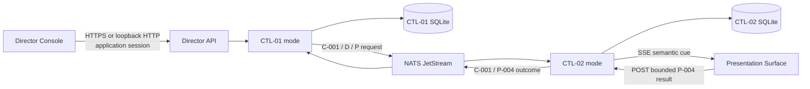

# M3.3 runtime walking-skeleton baseline

Status: Accepted design; implementation baseline built, final M3.3 evidence pending

Version: 0.2.0

Last reviewed: 27 August 2026

Decision authority: Public Purpose Lab founders

Related accepted baselines:
[M3 implementation sequence](../programme/implementation-plan.md),
[`CTL-01`](logical/components/ctl-01-scenario-director.md),
[`CTL-02`](logical/components/ctl-02-presentation-gateway-and-screen-registry.md),
[`D-001` to `D-004`](logical/contracts/demonstration/),
[`P-001` to `P-004`](logical/contracts/presentation/), and ADR-0011 to
ADR-0016

## Purpose and accepted decisions

M3.3 turns the accepted Scenario Director and presentation contracts into the
smallest executable runtime path. It establishes current implementation
bindings and a delivery sequence; it does not promote those bindings to
production or make them permanent where evidence supports revision.

The founders accepted four implementation-binding decisions on 27 August 2026:

| Decision                                                                                                  | Recommended baseline                                                                                                                                | Reason now                                                                                                                              |
| --------------------------------------------------------------------------------------------------------- | --------------------------------------------------------------------------------------------------------------------------------------------------- | --------------------------------------------------------------------------------------------------------------------------------------- |
| [ADR-0017](decisions/0017-use-canonical-json-and-repository-provenance-for-m3-scenario-packages.md)       | Closed JSON packages, JSON Schema, RFC 8785 canonicalisation and SHA-256; the first reviewed package is built read-only into the application image. | Gives one portable, inspectable definition and exact digest without introducing package upload, signing or distribution infrastructure. |
| [ADR-0018](decisions/0018-use-component-owned-sqlite-state-for-the-m3-single-instance-runtime.md)         | Separate component-owned SQLite databases, transactional inbox/state/outbox records, one writer and one replica.                                    | Supplies restart-safe decisions and idempotency locally and on a single attached volume without creating a shared database service.     |
| [ADR-0019](decisions/0019-bind-m3-controlled-time-reset-and-faults-to-bounded-runtime-adapters.md)        | Non-adjustable operational time, manually advanced scenario time, semantic component-owned reset and one-shot allow-listed faults.                  | Exercises the accepted control boundary without exposing arbitrary clock, database, script or platform administration.                  |
| [ADR-0020](decisions/0020-use-one-application-image-with-separate-director-and-presentation-workloads.md) | One Rust/frontend application image run in separate Director and Presentation Gateway modes, plus NATS JetStream.                                   | Reuses one artifact while retaining distinct state, broker permissions, failure and restart boundaries.                                 |

This acceptance establishes those choices as the current M3.3 implementation
baseline. It does not approve code by implication, close M3.3 or permit a
shared hosted demonstration.

The first implementation now exists in the repository. Native, independent OCI
Compose and Minikube assurance runs exercise the positive path, bounded fault,
restart and reset behaviour. M3.3 remains open until the reviewed source is
published as an immutable image and that exact digest completes the private
hosted gates listed under acceptance evidence.

## Outcome and claim boundary

The M3.3 outcome is one locally executable path in which:

1. `CTL-01` admits a versioned synthetic assurance package;
2. an explicitly local development-assurance presenter creates and starts one
   Demonstration Session;
3. `CTL-02` admits and registers a Presentation Surface capability;
4. `CTL-01` requests a short-lived semantic presentation cue through the
   `INT-01` NATS JetStream adapter;
5. the Presentation Gateway delivers the cue to the browser through SSE;
6. the surface resolves the semantic view and posts a bounded outcome;
7. `CTL-02` records and publishes the conclusive `P-004` result; and
8. `CTL-01` evaluates a presentation-progress checkpoint without treating it
   as business completion.

The same immutable application image and package digest are then deployed to a
private, time-bounded Google Cloud activation for ingress-free liveness,
contract, package and fail-closed readiness checks. The hosted M3.3 exercise
does not enable interactive presentation or NATS application traffic while the
managed-trust binding remains absent.

M3.3 remains synthetic-only and in development assurance. It does not provide:

- managed trust, Google presenter login or shared hosted access;
- multi-actor synthetic application sign-in;
- business-command or domain-state automation;
- Workbench asset upload, retrieval, RAG, workflow, analytics or reporting;
- multi-replica operation, high availability, backup/restore qualification or
  long-term evidence retention; or
- legal, clinical, professional, regulatory, compliance or production
  authority.

Those exclusions are visible in runtime readiness and user interfaces; they
are not documentation-only caveats.

## Runtime profiles

| Profile                   | Interactive path                                          | Trust and access                                                          | Persistence                                                  | M3.3 evidence                                                                     |
| ------------------------- | --------------------------------------------------------- | ------------------------------------------------------------------------- | ------------------------------------------------------------ | --------------------------------------------------------------------------------- |
| Native development        | Director and surfaces on loopback only                    | Explicit development-assurance session adapter; synthetic-only            | Separate local component databases                           | Fast contract, state and browser development                                      |
| Local containers          | Director and surfaces published on loopback only          | Environment-generated local-synthetic transport and workload material     | Named local volumes                                          | Complete positive walking-skeleton path and restart checks                        |
| Minikube                  | Port-forwarded Director and surfaces; no ordinary ingress | Local-synthetic environment setup and Kubernetes-scoped workload material | Separate `ReadWriteOnce` claims                              | Kubernetes packaging, restart and contract parity                                 |
| Private Google Cloud M3.3 | No ingress, browser URL or shared session                 | `managed` declared and intentionally not ready until M3.4                 | Activation-scoped state only where required by health checks | Same image/package, liveness, schema self-test and expected fail-closed readiness |

The public website is independent of every profile and cannot activate or keep
the runtime running.

## Logical and physical flow

Browsers do not connect to NATS or either database. The Director never sends a
URL, route, browser command or credential to a surface. The two backend modes
come from one image but run as separate processes with separate state,
configuration and broker identities.

## Component and contract binding

| Runtime responsibility                 | Initial owner and binding                                      | Contracts                                     | Boundary                                                                                          |
| -------------------------------------- | -------------------------------------------------------------- | --------------------------------------------- | ------------------------------------------------------------------------------------------------- |
| Package validation and admission       | `CTL-01` package module                                        | `D-001`, `C-003`, `C-004`, `C-005`, `C-006`   | Reads closed, image-bundled package files; cannot execute or fetch package content.               |
| Session lifecycle and checkpoint state | `CTL-01` session module and its SQLite repository              | `D-002`, `D-004`                              | Owns scenario coordination only; uses expected revisions and durable idempotency.                 |
| Reset, time and fault coordination     | `CTL-01` coordinator calling owner adapters                    | `D-003`                                       | No arbitrary system clock, database, shell, network or Kubernetes access.                         |
| Surface capability and registration    | `CTL-02` registry module and its SQLite repository             | `P-001`, `P-002`                              | At most one current registration per session/surface slot.                                        |
| Cue validation and delivery            | `CTL-02` delivery module                                       | `P-003`                                       | SSE carries one semantic allow-listed view and opaque connection cursor only.                     |
| Surface outcome validation             | `CTL-02` outcome module                                        | `P-004`                                       | POST result is bound to the current registration generation; appearance is not proof.             |
| Durable component transport            | `INT-01` NATS adapter                                          | `C-001` to `C-006` plus D/P messages          | At least once, explicit acknowledgement after a durable decision, no browser access.              |
| Presenter and surface browser UI       | `UX-03`, `UX-04`, then the Workbench shell as a second surface | Versioned HTTP/SSE adapter over D/P semantics | UI state is not authoritative; development session adapter is unavailable outside local profiles. |

The HTTP API is a versioned physical adapter described by an OpenAPI document.
Its paths are not semantic contract identifiers and never appear in scenario
packages, cues or public evidence. Backend request handlers construct or
validate the accepted D/P and common-contract types before invoking domain
modules.

The current adapter is published as
[`contracts/http/m3-runtime.openapi.yaml`](../../contracts/http/m3-runtime.openapi.yaml).

## Scenario package baseline

The first package is `presentation-control-assurance` and contains only
synthetic, repository-owned content. It declares:

- one presenter role supplied by the local development-assurance adapter;
- one `audience-display` surface slot for the first vertical slice;
- a later `reviewer-workbench` slot using the same registration/cue path;
- a small stage sequence covering prepare, start, semantic cue, outcome,
  presentation checkpoint, stop and reset;
- one supported cue and one unsupported/expired negative case;
- a manual-step logical-time capability;
- component-owned Director and Presentation reset targets; and
- one owner-published, bounded presentation delivery fault.

The package cannot contain code, expressions, URLs, routes, NATS subjects,
database identifiers, secrets or arbitrary fault parameters. The schemas use
closed objects and refuse unknown fields. Timestamps, identifiers and exact
duration values use strings where cross-runtime numerical interpretation could
change a digest.

For M3.3 the package and small fixture manifest are copied into the application
image during the reviewed build. Runtime upload, mutable package stores,
external retrieval and general signing are deliberately absent. Admission
records the package semantic version, canonical content digest, source
revision and container image digest.

## State, transaction and delivery model

`CTL-01` and `CTL-02` each own a separate SQLite database. They do not query,
join or write one another's tables. References cross the component boundary
only through accepted contract identifiers and safe `C-004` evidence
references.

Each protected component operation uses one local transaction to record:

1. the inbox message identity and immutable semantic fingerprint;
2. current expected revision and authority decision reference;
3. the accepted, refused, duplicate, expired, failed or uncertain outcome;
4. the resulting component-owned state revision; and
5. any component event placed in a durable outbox.

The outbox publisher sends after commit. A NATS consumer acknowledges only
after its receiving component has durably recorded the inbox and semantic
decision. Identical redelivery returns the original outcome; changed content
under the same idempotency scope is refused. Startup reconciles pending outbox,
inbox and uncertain operations before reporting ready.

The first runtime is one replica per component mode with one block-backed,
`ReadWriteOnce` volume per database. It is not valid to scale either workload
above one replica or mount its SQLite database on a shared network filesystem.
NATS owns separate JetStream storage and retention.

## Operational time, scenario time, reset and faults

Security and delivery expiry use an injected operational-clock interface backed
by UTC wall time plus monotonic elapsed time. No scenario command or UI can
change it. Tests may replace the interface inside a test process; that adapter
is not a runtime `D-003` capability.

M3.3 scenario time uses manual-step progression only:

- `SetScenarioLogicalTime` establishes the package-declared initial instant;
- `AdvanceScenarioLogicalTime` moves forward within package bounds; and
- each accepted change creates a new session-scoped revision with both logical
  and observed operational times.

Backwards movement and use of logical time for a cue, registration, token,
session, policy or message expiry are refused.

The initial reset plan has only two required semantic targets:

- `director-control-baseline`, owned by `CTL-01`; and
- `presentation-registry-baseline`, owned by `CTL-02`.

It terminates or supersedes disposable session state while retaining security,
idempotency, operation and evidence history. A successful reset creates a new
Demonstration Session. It never deletes trust material or repairs an
environment.

The initial fault is a one-shot, automatically expiring
`presentation-cue-delay` profile owned by `CTL-02`. Its delay range is closed
and bounded by the package and runtime configuration. It cannot affect
identity, authorisation, audit, operational time, another session or another
environment. Additional fault profiles require owner definitions and tests;
there is no generic fault API.

## Browser and development-assurance binding

The local interactive path uses an explicit development-assurance adapter that
creates a short-lived backend session for an allow-listed test presenter. The
adapter:

- is enabled only by an exact local/native, local-container or Minikube
  development profile;
- binds only to loopback or a port-forwarded local endpoint;
- displays an unavoidable synthetic/development banner;
- produces the same typed `I-001` and authority context used by the backend;
- cannot issue a reusable credential or Google identity; and
- is absent from readiness and returns a terminal refusal when the environment
  class is hosted, shared or managed.

This is an assurance mechanism, not an alternative login product. M3.4 binds
interactive presenters through the accepted Google OIDC and ordinary backend
session design and binds hosted workloads through managed identity.

The Presentation Gateway serves the frontend assets for registered surfaces,
provides the SSE cue channel and receives outcome POSTs. Same-origin sessions,
origin checks, content-security policy and bounded reconnect state are applied
even in the local profile. Browser storage contains no broker credentials,
signed grants or authoritative registration state.

## Deployment composition

The application build produces one immutable image containing:

- the Rust runtime and database migrations;
- `CTL-01`, `CTL-02` and `INT-01` adapters selected by process mode;
- the compiled Director, Presentation and existing Workbench shell assets;
- canonical D/P schemas and conformance fixtures; and
- the first read-only scenario package and its build-produced digest manifest.

The image runs as two application workloads:

- `scenario-director`, with only Director state and NATS permissions; and
- `presentation-gateway`, with only surface state and NATS permissions.

NATS JetStream is a third runtime service with file storage. Local Compose and
Minikube supply separate generated NKeys and TLS material through environment
setup; none enters the image or frontend. Minikube uses the accepted official
NATS chart with reviewed, pinned values. Application manifests remain under
Kustomize.

The release image serves its owning frontend assets itself, avoiding a new
reverse-proxy component. Development Vite servers may proxy to loopback
backends but are not release artifacts.

Local endpoints bind to loopback. Minikube uses `ClusterIP` services and
explicit port-forwarding. The M3.3 Google Cloud overlay creates no Ingress,
LoadBalancer or public application Service. It uses the exact application image
digest, runs package/schema self-tests and proves the expected managed-trust
readiness refusal before teardown.

## Implementation slices

### M3.3.1 — canonical contracts and package

- Add canonical schemas, descriptors, compatibility declarations, examples and
  invalid fixtures for `D-001` to `D-004` and `P-001` to `P-004`.
- Generate or maintain equivalent Rust and TypeScript types through the
  existing contract boundary.
- Implement strict package parsing, canonicalisation, digest calculation,
  admission and the first assurance package.
- Prove unknown-field, duplicate-key, secret/route-like content, size,
  compatibility and digest-conflict refusal.

### M3.3.2 — component-owned state and lifecycle

- Add `CTL-01` and `CTL-02` crates and separate persistence repositories.
- Implement migrations, integrity/startup checks, inbox/state/outbox
  transactions, expected revisions and restart reconciliation.
- Implement package admission, create, prepare, start, pause, resume, stop and
  the presentation-progress checkpoint.
- Leave unsupported actions explicitly refused rather than silently stubbed.

### M3.3.3 — event and presentation path

- Implement the NATS `INT-01` adapter and per-mode publish/subscribe policy.
- Implement `P-001` admission, `P-002` registration, `P-003` delivery and
  `P-004` outcome handling.
- Replace the Director and Presentation skeletons with accessible live status,
  lifecycle, registration, cue and outcome views.
- Add the second Workbench surface slot after the first Presentation Surface
  path is green.

### M3.3.4 — bounded assurance controls

- Implement manual-step scenario time, the two reset adapters and the one-shot
  cue-delay fault.
- Prove that operational expiry remains unaffected, reset creates a successor
  session and prior-session events cannot satisfy current checkpoints.
- Add duplicate, unsupported, expired and uncertain outcome cases.

### M3.3.5 — portable deployment and evidence

- Run the complete path natively, in local containers and in Minikube from the
  same image and package digests.
- Exercise application and broker restart, redelivery and state reconciliation.
- Capture browser, message, log and evidence disclosure scans.
- Activate the private Google Cloud environment, deploy the image without
  ingress, run health/contract/fail-closed checks, capture inventory and cost,
  and explicitly turn it off.

Slices are evidence gates, not a promise that no refactoring will occur. A
later slice may revise an earlier mechanism through an explicit ADR without
weakening its accepted contract or security invariant silently.

## Acceptance evidence

M3.3 is complete only when evidence shows:

- every new D/P schema accepts its canonical examples and refuses its negative
  fixtures in Rust, TypeScript and repository checks;
- the same package digest is admitted across native, container and Minikube
  runs;
- the Director completes one lifecycle/cue/outcome/presentation-checkpoint
  path without using a URL or browser route as contract meaning;
- the two component modes use separate databases and NATS identities;
- duplicate and changed-content commands, unsupported views, expired cues and
  stale revisions produce their specified safe outcomes;
- process and broker interruption reconcile without a duplicate semantic
  effect or invented success;
- scenario time cannot extend operational validity;
- reset preserves prior evidence and produces a distinct successor session;
- the bounded fault expires or clears and cannot affect excluded controls;
- frontend artifacts, browser storage, messages, logs and evidence contain no
  credentials, grants, sessions, private NATS subjects or internal routes;
- local and Minikube UIs clearly display development/synthetic maturity;
- the Google Cloud smoke uses the identical image digest, exposes no endpoint,
  refuses interactive readiness without managed trust and leaves no disposable
  resources after `off`; and
- test results, activation duration, gross usage, credits and net cost are
  recorded without overstating capability.

M3.3 evidence qualifies an in-development walking skeleton only. M3.4 remains
the gate for managed trust, external presenter login, workload identity,
synthetic application sessions and the fuller restart/reconnect/security suite.

Implementation and evidence status is maintained in the
[M3.3 evidence record](evidence/m3-3-runtime-walking-skeleton.md). Operational
use is described in the [M3.3 operator guide](../guides/m3-3-operator-guide.md).

## Reference material

- [RFC 8785: JSON Canonicalization Scheme](https://www.rfc-editor.org/info/rfc8785/)
- [JSON Schema specification](https://json-schema.org/specification)
- [SQLite write-ahead logging](https://www.sqlite.org/wal.html)
- [Kubernetes persistent volumes](https://kubernetes.io/docs/concepts/storage/persistent-volumes/)
- [Kubernetes single-instance stateful application](https://kubernetes.io/docs/tasks/run-application/run-single-instance-stateful-application/)
